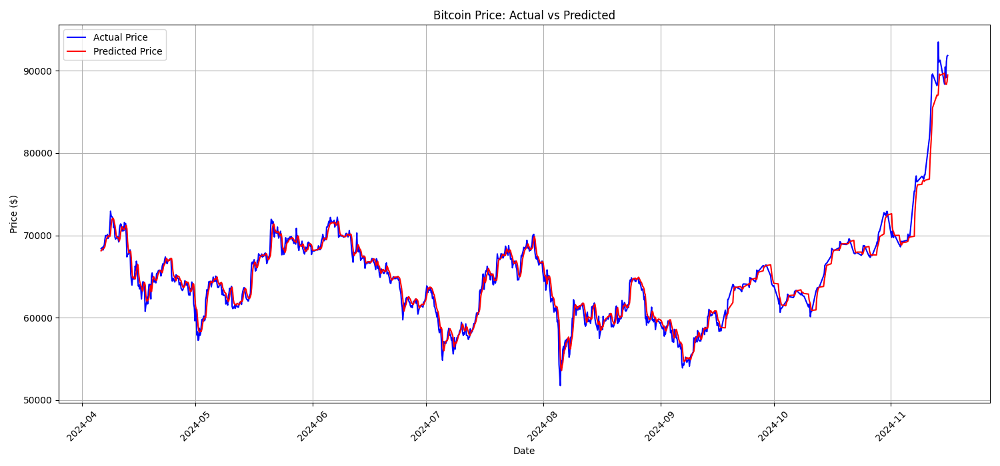
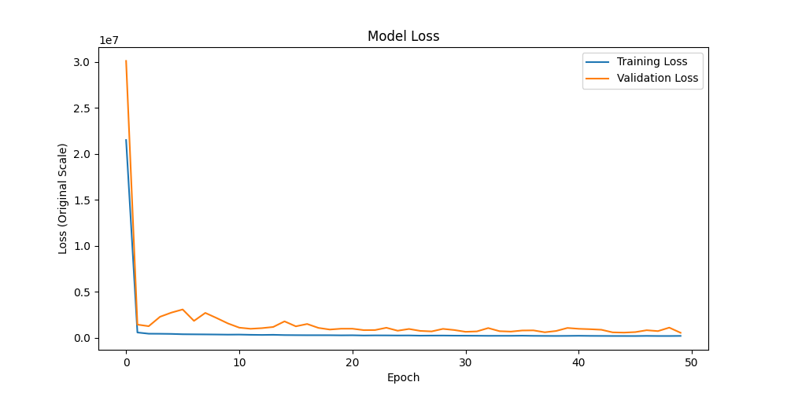

# Bitcoin Price Prediction - Experiment 1

## Overview
This experiment implements a basic LSTM model for Bitcoin price prediction using historical BTCUSD data. 
*Note: This initial experiment contained a methodological error where data scaling was performed before train-test splitting.*

## Dataset
- Source: [Bitcoin Historical Data (Kaggle)](https://www.kaggle.com/datasets/mczielinski/bitcoin-historical-data)
- Timeframe: Starting from 2022-01-01
- Sampling: Resampled from minute-level data to 4-hour intervals
- Split: 80% training, 20% testing

## Features
- Input variables: Open, High, Low, Close, Volume
- Target variable: Close price
- Sequence length: 60 timesteps (10 days of 4-hour data)

## Model Architecture
LSTM implementation with:
- Input size: 5 (features)
- Hidden size: 100
- Output size: 1 (predicted close price)
- Optimization: Adam optimizer with learning rate 0.0005 and L2 regularization (weight_decay=1e-5)
- Loss function: MSE
- Training epochs: 50
- Batch size: 32
- Device: CPU

## Results
### Price prediction performance

- The model shows good tracking of overall price trends
- Notable accuracy in predicting the major price surge in late 2024
- Some lag in extreme price movement predictions

### Training Performance

- Training and validation losses show consistent convergence
- No significant overfitting observed
- Initial high loss reduced significantly during training

## Limitations & Lessons learned
1. Methodological error: Data scaling was performed on the entire dataset before splitting
2. Future improvements should include:
   - Proper train-test split before scaling
   - Results should include better plots and metrics
   - Add proper logging