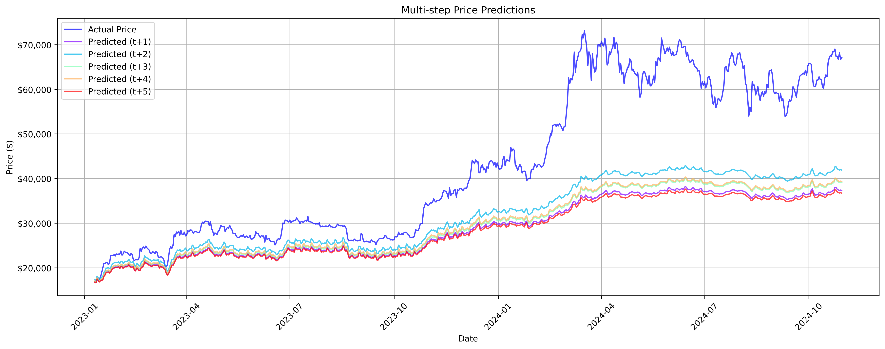
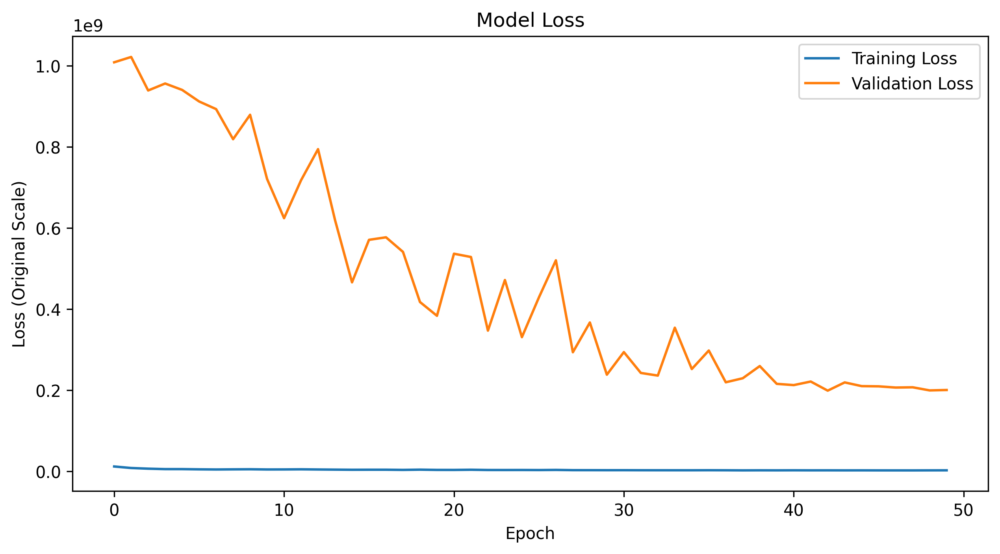
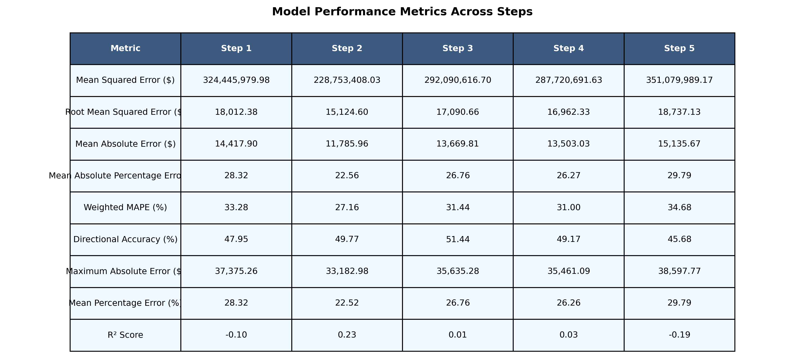
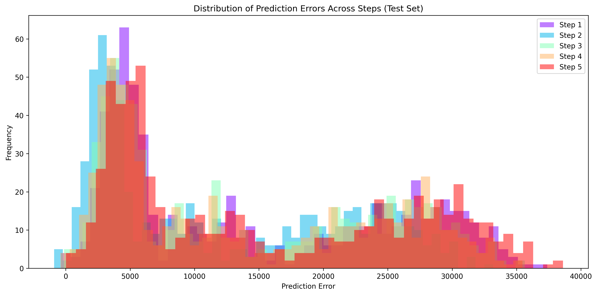
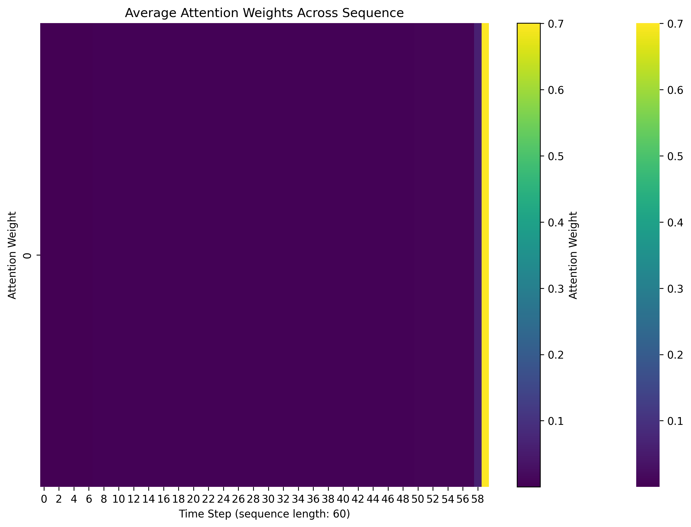
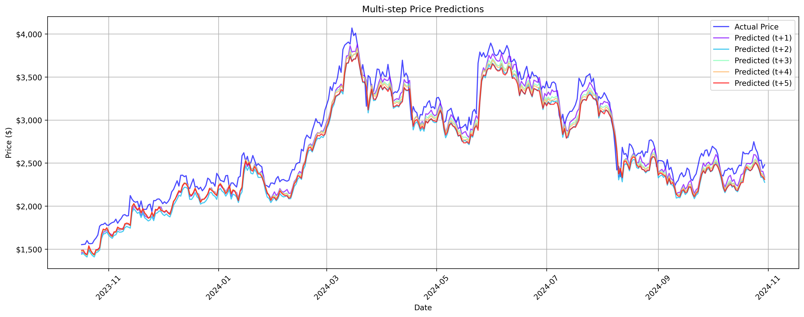
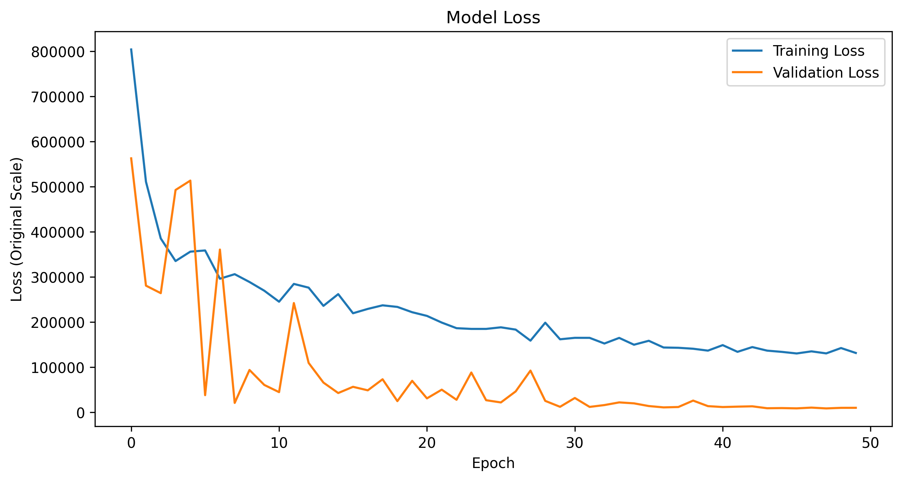
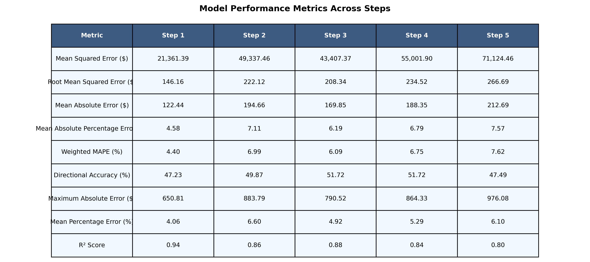
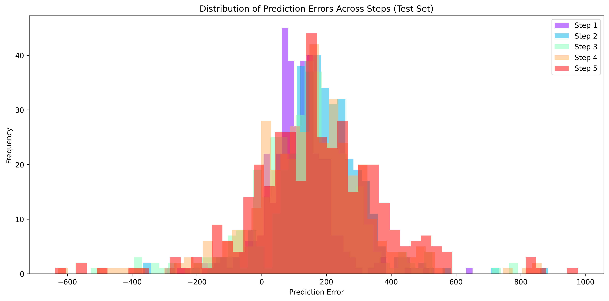
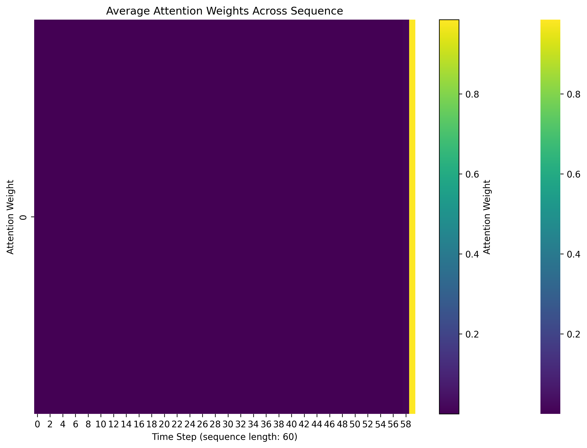

# Cryptocurrency price prediction - Experiment 10

## Overview

This experiment adds multi-step prediction to the LSTM architecture from Experiment 9. The goal is to evaluate the model's performance in predicting multiple future timesteps and assess its ability to capture longer-term price trends.
It predicts 5 future timesteps (5 days ahead) based on the last 60 days of daily data.

## Conclusion

- The models showed significantly different performance between BTC and ETH predictions:
  - BTC model demonstrated moderate to poor performance with R² ranging from -0.19 to 0.23
  - ETH model showed exceptional performance with R² ranging from 0.80 to 0.94

- Error rates varied substantially between assets:
  - BTC showed high error rates with MAPE ranging from 22.56% to 29.79%
  - ETH achieved remarkably low error rates with MAPE ranging from 4.58% to 7.57%

- The multi-step prediction architecture showed:
  - Consistently strong performance for ETH across all prediction horizons
  - Declining accuracy for BTC with longer prediction horizons
  - Clear disparity in model effectiveness between the two cryptocurrencies
  - Better performance in shorter prediction horizons (t+1, t+2) compared to longer ones (t+4, t+5)

## Dataset
- Source:
  - [ETH/USD Data](https://www.kaggle.com/datasets/imranbukhari/comprehensive-ethusd-1m-data)
  - [BTC/USD Data](https://www.kaggle.com/datasets/imranbukhari/comprehensive-btcusd-1m-data)

- Timeframe: for BTC/USD dataset
  - Start: 2011-08-18
  - End: 2024-10-30
- Timeframe: for ETH/USD dataset
  - Start: 2016-09-29
  - End: 2024-10-30
- Sampling: 24-hour intervals
- Split: 70% training, 15% validation, 15% testing

## Features
- Input variables: Volume, Open, High, Low, Close
- Target variable: Close price
- Sequence length: 60 timesteps (60 days of daily data)

## Model architecture
Advanced LSTM implementation with:
- Input size: 5 (features)
- Hidden size: 256 (increased from 128)
- Number of layers: 3 (increased from 2)
- Dropout rate: 0.3 (increased from 0.2)
- Output size: 1 (predicted close price)

## Training Parameters
- Optimizer: Adam
  - Learning rate: 0.001
  - Betas: (0.9, 0.999)
  - Epsilon: 1e-8
  - Weight decay: 1e-5
- Loss function: MSE
- Training epochs: 50
- Batch size: 64 (increased from 32)
- Device: CPU
- Learning rate scheduling with `OneCycleLR` to adjust learning rate dynamically during training to improve convergence
- Multi-step prediction: 5 future timesteps (5 days ahead)

## Results for BTC/USD dataset

### Price prediction performance

- More complex prediction patterns with 5 different forecast horizons (t+1 to t+5)
- Similar challenges with higher price ranges ($60,000-$70,000):
  - All prediction steps consistently underestimate actual prices after Q1 2024
  - Longer prediction horizons (t+4, t+5) show greater deviation from actual prices
  - Predictions cluster between $35,000-$40,000 while actual prices show higher variability

### Training performance

- Training loss (blue line) remains consistently low throughout all 50 epochs
- Validation loss (orange line) shows steady improvement:
  - Starting around 1.0e9
  - Stabilizing near 0.2e9 after epoch 40
  - Notable fluctuations during training indicate model adaptation

### Metrics

- Step 2 shows best overall performance:
  - Lowest RMSE: $15,124.60
  - Best MAPE: 22.56%
  - Highest R² Score: 0.23
  - Best Directional Accuracy: 49.77%

- Performance generally deteriorates with longer horizons:
  - Step 5 shows worst metrics:
    - Highest RMSE: $18,737.13
    - Highest MAPE: 29.79%
    - Lowest R² Score: -0.19
    - Lowest Directional Accuracy: 45.68%

- All steps show relatively poor R² scores, ranging from -0.19 to 0.23
- Directional accuracy remains close to 50% across all steps
- Mean Absolute Errors range from $11,785.96 (Step 2) to $15,135.67 (Step 5)

### Other results

[Raw Training Log](results/btc/training.log)
[Model Specifications](results/btc/model_specifications.txt)

## Results for ETH/USD dataset

### Price prediction performance

- Multi-step predictions tracking price movements between $1,500-$4,000 range
- Model shows good adaptability across different market conditions:
  - Accurately captures major price trends from late 2023 to late 2024
  - Predictions closely follow actual prices during both upward and downward trends
  - Shorter horizons (t+1, t+2) demonstrate better accuracy than longer ones
  
### Training performance

- Training loss (blue line) shows excellent convergence:
  - Starting from ~800,000
  - Steadily decreasing to ~150,000 by epoch 50
- Validation loss (orange line) demonstrates stable improvement:
  - Initial volatility in early epochs
  - Stabilizes around epoch 30
  - Final convergence below 50,000

### Metrics

- Step 1 shows best overall performance:
  - Highest R² Score: 0.94
  - Lowest MAPE: 4.58%
  - Lowest MAE: $122.44
  - Strong baseline performance

- Performance gradually decreases with prediction horizon:
  - Step 5 shows expected degradation:
    - R² Score: 0.80
    - MAPE: 7.57%
    - MAE: $212.69
    - Maximum Absolute Error: $976.08

- All steps maintain strong R² scores (0.80-0.94)
- Directional accuracy remains consistent around 47-51%
- WMAPE ranges from 4.40% (Step 1) to 7.62% (Step 5)

### Other results

[Raw Training Log](results/eth/training.log)
[Model Specifications](results/eth/model_specifications.txt)