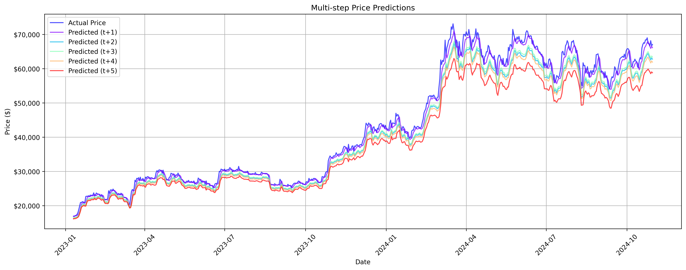
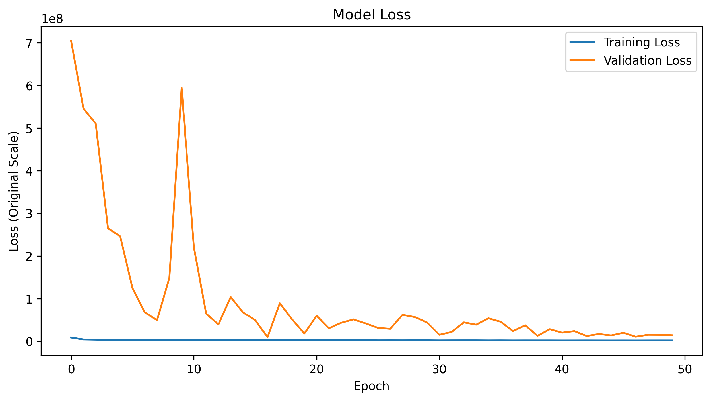
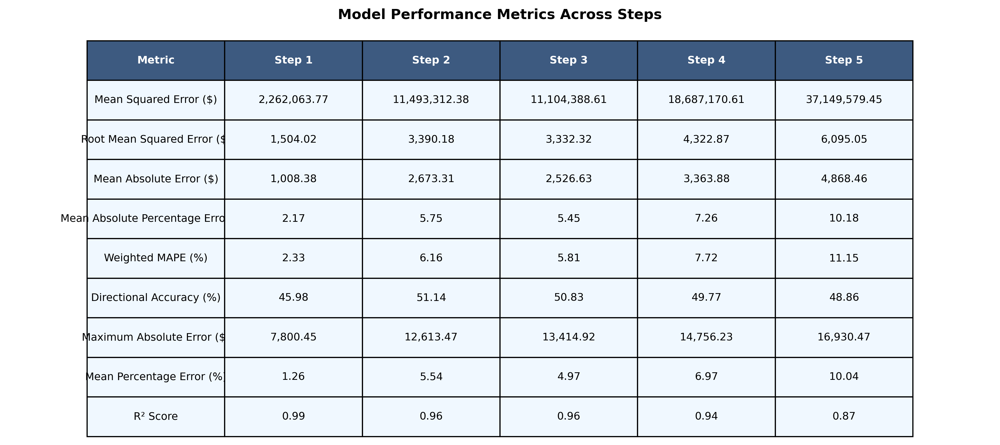
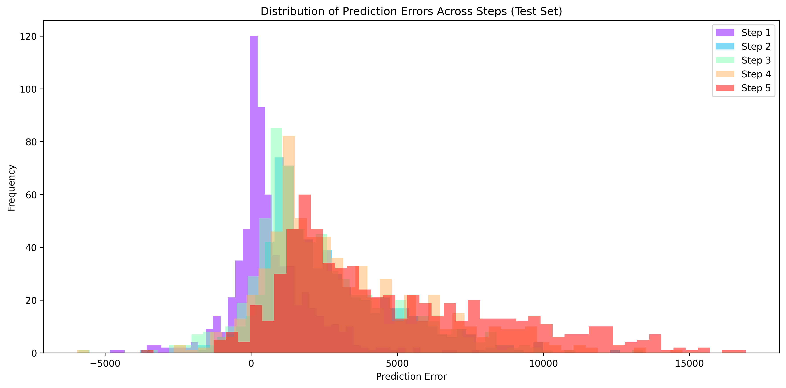
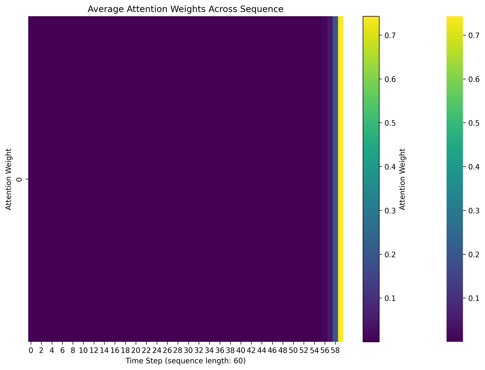
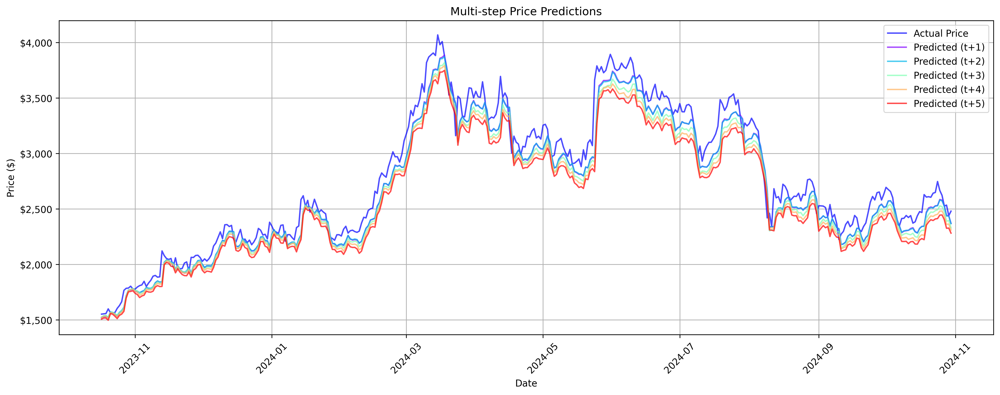
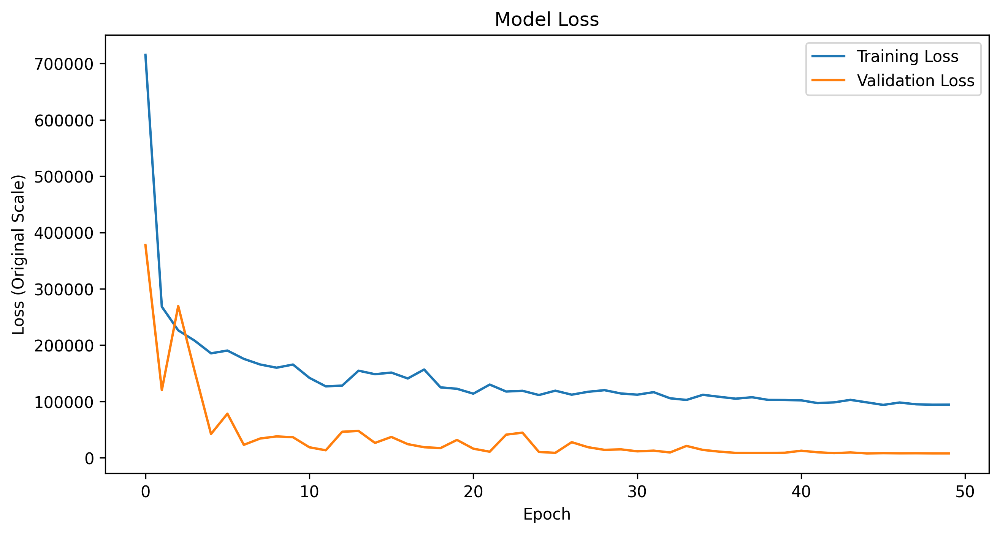
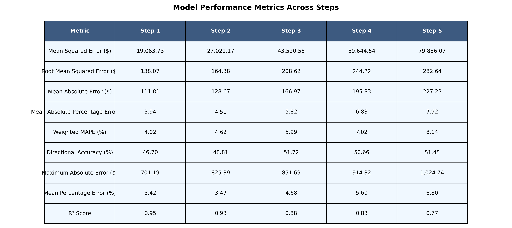
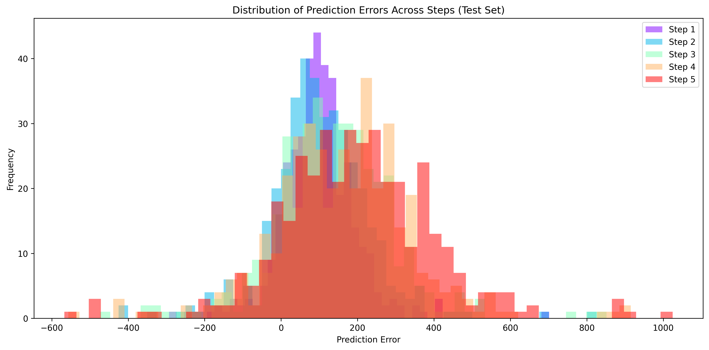
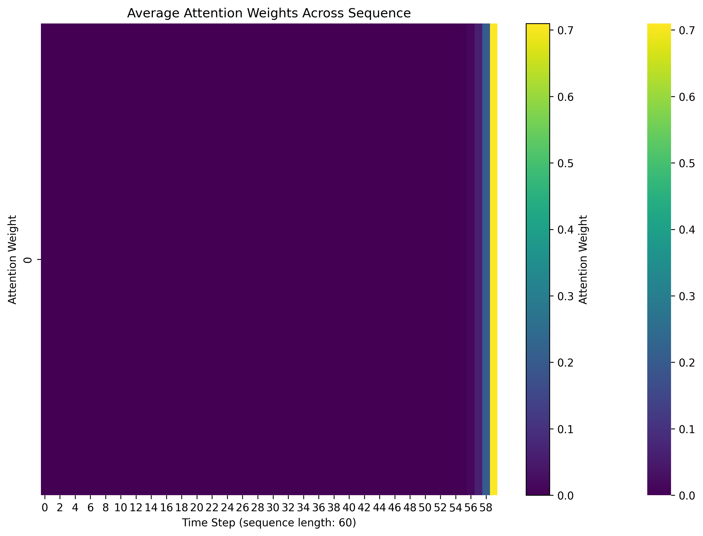

# Cryptocurrency price prediction - Experiment 11

## Overview

This experiment uses the same multi-step prediction approach as Experiment 10 but reverts to the LSTM architecture from Experiment 6. The focus is on refining the multi-step prediction model to improve performance and better capture longer-term price trends. The model predicts 5 future timesteps (5 days ahead) based on the last 60 days of daily data.

## Conclusion

- The architecture from experiment 6 demonstrated strong performance for both BTC/USD and ETH/USD predictions, showing significant improvements over the previous experiment 10
- BTC/USD predictions achieved exceptional accuracy with R² scores ranging from 0.87 to 0.99 and low MAPE values (2.17% for t+1), indicating robust short-term forecasting capability
- ETH/USD predictions also showed strong performance with R² scores between 0.77 and 0.95, and reasonable MAPE values (3.94% for t+1)
- Both models exhibited expected degradation in accuracy with longer prediction horizons, but maintained acceptable performance even at t+5
- The training process showed good stability for both assets, with consistent loss reduction and proper convergence
- The architectural changes proved beneficial, particularly for BTC/USD predictions which showed marked improvement in handling high price ranges
- The architecture appears more suitable for both high-value (BTC) and moderate-value (ETH) cryptocurrencies, demonstrating better scalability than previous implementations
- The results validate the decision to revert the architecture, showing it can handle different price scales and volatility patterns effectively

## Dataset
- Source:
  - [ETH/USD Data](https://www.kaggle.com/datasets/imranbukhari/comprehensive-ethusd-1m-data)
  - [BTC/USD Data](https://www.kaggle.com/datasets/imranbukhari/comprehensive-btcusd-1m-data)

- Timeframe: for BTC/USD dataset
  - Start: 2011-08-18
  - End: 2024-10-30
- Timeframe: for ETH/USD dataset
  - Start: 2016-09-29
  - End: 2024-10-30
- Sampling: 24-hour intervals
- Split: 70% training, 15% validation, 15% testing

## Features
- Input variables: Volume, Open, High, Low, Close
- Target variable: Close price
- Sequence length: 60 timesteps (60 days of daily data)

## Model architecture
Advanced LSTM implementation with:
- Input size: 5 (features)
- Hidden size: 256 (increased from 128)
- Number of layers: 3 (increased from 2)
- Dropout rate: 0.3 (increased from 0.2)
- Output size: 1 (predicted close price)

## Training Parameters
- Optimizer: Adam
  - Learning rate: 0.001
  - Betas: (0.9, 0.999)
  - Epsilon: 1e-8
  - Weight decay: 1e-5
- Loss function: MSE
- Training epochs: 50
- Batch size: 64 (increased from 32)
- Device: CPU
- Learning rate scheduling with `OneCycleLR` to adjust learning rate dynamically during training to improve convergence
- Multi-step prediction: 5 future timesteps (5 days ahead)

## Results for BTC/USD dataset

### Price prediction performance

- More complex prediction patterns with 5 different forecast horizons (t+1 to t+5)
- Notable price range evolution ($20,000-$70,000):
  - Steady increase from $20,000 in early 2023
  - Sharp rise to $60,000-$70,000 range in Q1 2024
  - Model tracks overall trends but shows increasing deviation at higher prices
  - Longer prediction horizons (t+4, t+5) consistently predict lower values

### Training performance

- Training loss (blue line) remains consistently low throughout all 50 epochs
- Validation loss (orange line) shows significant improvement:
  - Starting around 7.0e8
  - Sharp drop in first 10 epochs
  - Major spike around epoch 10
  - Stabilizing below 1.0e8 after epoch 20

### Metrics

- Step 1 shows best overall performance:
  - Lowest MSE: $2,262,063.77
  - Best MAPE: 2.17%
  - Highest R² Score: 0.99
  - MAE: $1,008.38

- Performance gradually decreases with longer horizons:
  - Step 5 shows highest errors:
    - Highest MSE: $37,149,579.45
    - Highest MAPE: 10.18%
    - Lowest R² Score: 0.87
    - Highest MAE: $4,868.46

- Strong R² scores across all steps (0.87-0.99)
- Directional accuracy remains near 50% for all steps
- WMAPE ranges from 2.33% (Step 1) to 11.15% (Step 5)

### Other results

[Raw Training Log](results/btc/training.log)

[Model Specifications](results/btc/model_specifications.txt)

## Results for ETH/USD dataset

### Price prediction performance

- More complex prediction patterns with 5 different forecast horizons (t+1 to t+5)
- Notable price range evolution ($1,500-$4,000):
  - Steady increase from $1,500 in late 2023
  - Peak reaching around $4,000 in March 2024
  - Second peak around $3,800 in July 2024
  - Decline to $2,000-$2,500 range in late 2024
  - Model tracks overall trends but shows increasing deviation with longer horizons
  - Longer prediction horizons (t+4, t+5) consistently predict lower values
  
### Training performance

- Training loss (blue line) shows strong improvement:
  - Starting around 700,000
  - Sharp drop in first few epochs
  - Gradual decrease and stabilization around 100,000 after epoch 30
- Validation loss (orange line) shows significant improvement:
  - Starting around 400,000
  - Volatile first 10 epochs
  - Stabilizing below 50,000 after epoch 20

### Metrics

- Step 1 shows best overall performance:
  - MSE: $19,063.73
  - MAPE: 3.94%
  - Highest R² Score: 0.95
  - MAE: $111.81

- Performance gradually decreases with longer horizons:
  - Step 5 shows highest errors:
    - MSE: $79,886.07
    - MAPE: 7.92%
    - Lowest R² Score: 0.77
    - MAE: $227.23

- Strong R² scores across all steps (0.77-0.95)
- Directional accuracy ranges from 46.70% to 51.72%
- WMAPE ranges from 4.02% (Step 1) to 8.14% (Step 5)

### Other results

[Raw Training Log](results/eth/training.log)

[Model Specifications](results/eth/model_specifications.txt)