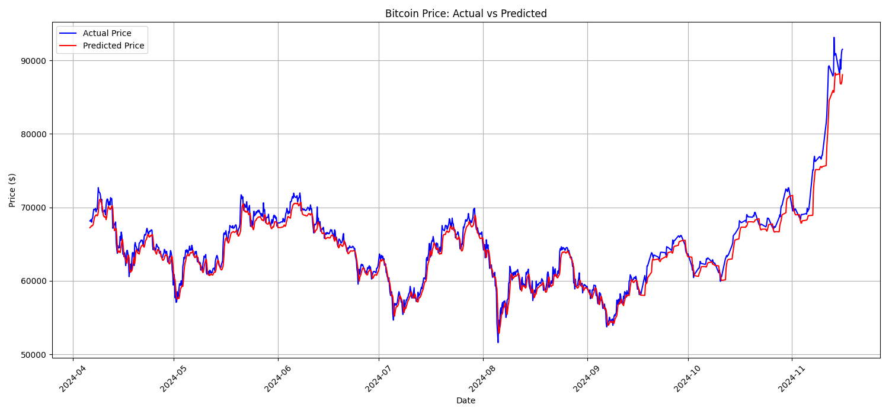
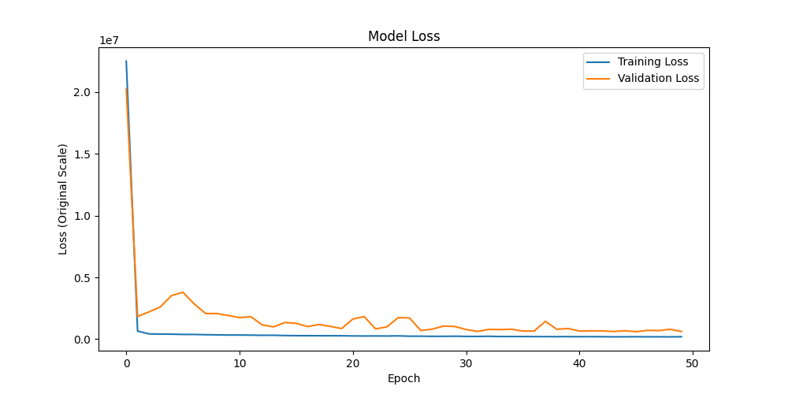

# Bitcoin price prediction - Experiment 2

## Overview
This experiment implements an improved LSTM model for Bitcoin price prediction, addressing the scaling methodology issue from Experiment 1.

## Dataset
- Source: [Bitcoin Historical Data (Kaggle)](https://www.kaggle.com/datasets/mczielinski/bitcoin-historical-data)
- Timeframe: 2022-01 to 2024-11
- Sampling: 4-hour intervals
- Split: 80% training, 20% testing (split performed before scaling)

## Features
- Input variables: Open, High, Low, Close, Volume
- Target variable: Close price
- Sequence length: 60 timesteps (10 days of 4-hour data)

## Model architecture
LSTM implementation with:
- Input size: 5 (features)
- Hidden size: 100
- Output size: 1 (predicted close price)
- Optimization: Adam optimizer with learning rate 0.0005 and L2 regularization (weight_decay=1e-5)
- Loss function: MSE
- Training epochs: 50
- Batch size: 32
- Device: CPU

## Results
### Price prediction performance

- Excellent tracking of price movements between $50,000-$70,000 range
- Highly accurate prediction of the significant price surge to $90,000 in late 2024
- Minimal prediction lag compared to Experiment 1
- Model successfully captures both gradual trends and sharp price movements

### Training performance

- Rapid initial convergence of training loss
- Validation loss shows stable improvement throughout training
- No signs of overfitting with both losses decreasing steadily
- Final loss values indicate strong model performance