# Cryptocurrency price prediction - Experiment 3

## Overview
This experiment presents an enhanced LSTM model implementation with improved code structure, comprehensive logging, and expanded datasets. A key improvement is the proper train/validation/test split for more robust evaluation. 

## Conclusion

- The LSTM model showed significantly better performance for ETH/USD (R² = 0.99) compared to BTC/USD (R² = 0.77)
- ETH predictions were more accurate with lower relative errors (MAPE: 2.09% vs 10.67% for BTC)
- ETH typically trades in a narrower absolute price range compared to BTC, which may have contributed to the model's better performance
- Both models demonstrated strong capabilities in tracking general price trends, but struggled with extreme price movements

## Dataset
- Source:
  - [ETH/USD Data](https://www.kaggle.com/datasets/imranbukhari/comprehensive-ethusd-1m-data)
  - [BTC/USD Data](https://www.kaggle.com/datasets/imranbukhari/comprehensive-btcusd-1m-data)

- Timeframe: for BTC/USD dataset
  - Start: 2011-08-18
  - End: 2024-10-30
- Timeframe: for ETH/USD dataset
  - Start: 2016-09-29
  - End: 2024-10-30
- Sampling: 4-hour intervals
- Split: 70% training, 15% validation, 15% testing

## Features
- Input variables: Volume, Open, High, Low, Close
- Target variable: Close price
- Sequence length: 60 timesteps (10 days of 4-hour data)

## Model architecture
LSTM implementation with:
- Input size: 5 (features)
- Hidden size: 100
- Output size: 1 (predicted close price)
- Optimization: Adam optimizer with learning rate 0.0005 and L2 regularization (weight_decay=1e-5)
- Loss function: MSE
- Training epochs: 50
- Batch size: 32
- Device: CPU

## Results for BTC/USD dataset

### Price prediction performance
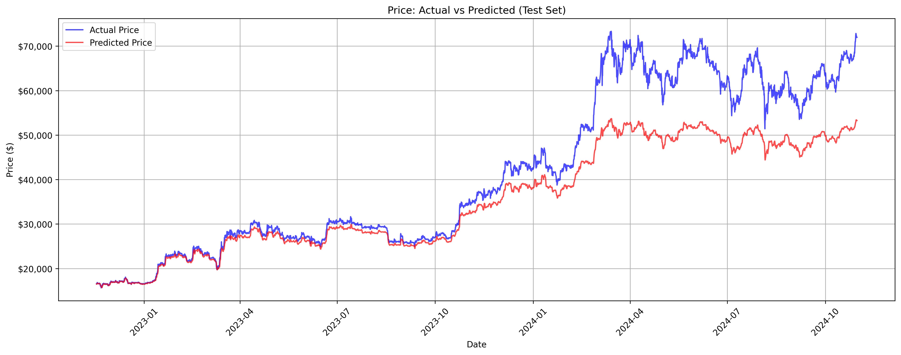
- Model predictions closely follow actual prices until early 2024
- Significant underestimation during price surges above $60,000
- Better tracking of price movements in lower ranges ($20,000-$30,000)
- Growing prediction gap in recent months of 2024

### Training performance
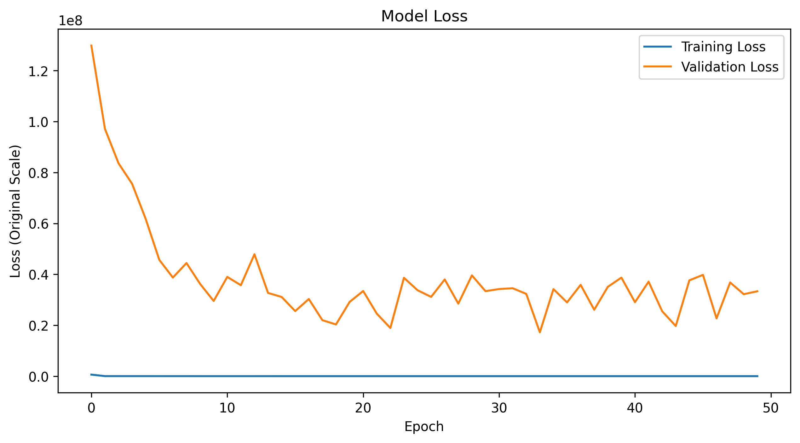

- Sharp decrease in first 10 epochs
- Stabilization around 0.3e8 after epoch 20
- Training loss remains consistently low

### Metrics
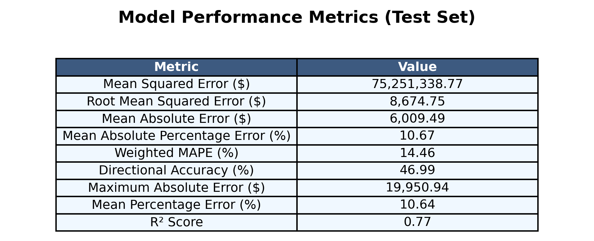

- Strong overall predictive capability with an R² score of 0.77, indicating the model explains 77% of the price variance
- Average prediction error (RMSE) of $8,674.75, with mean absolute error of $6,009.49
- Relative error measures show:
  - Mean Absolute Percentage Error (MAPE) of 10.67%
  - Weighted MAPE of 14.46%
  - Mean Percentage Error of 10.64%
- Directional Accuracy of 46.99%, suggesting room for improvement in trend prediction
- Maximum observed error of $19,950.94, indicating potential challenges with extreme price movements
- Mean Squared Error of $75,251,338.77, reflecting the model's sensitivity to larger prediction errors

### Other results
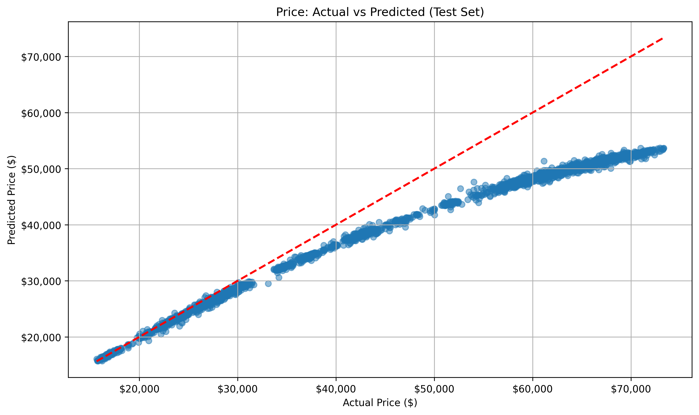
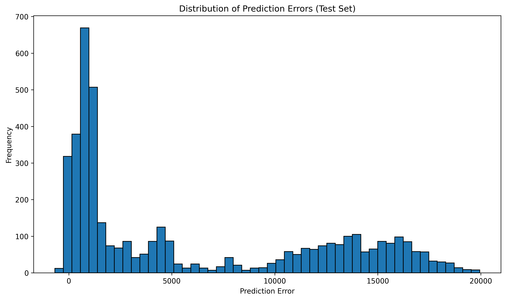
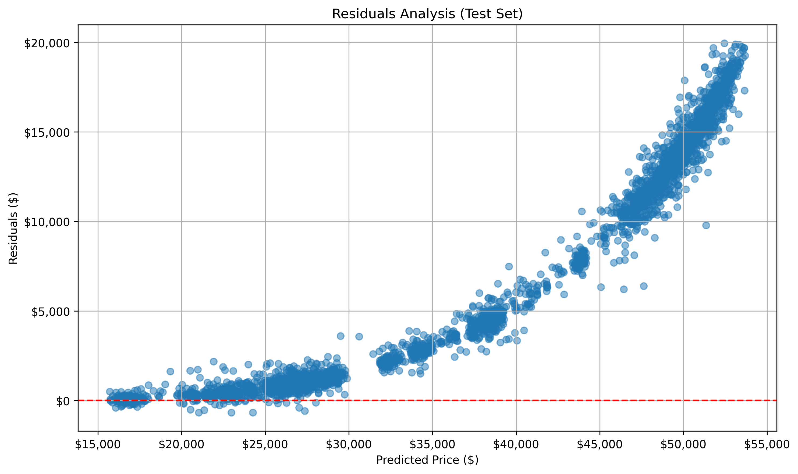
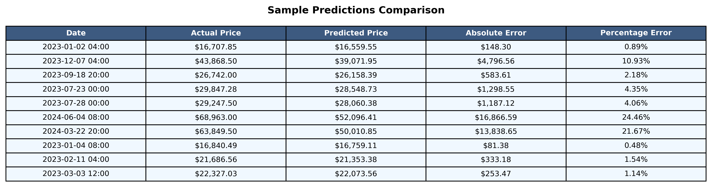
[Raw Training Log](results/btc/training.log)
[Model Specifications](results/btc/model_specifications.txt)

## Results for ETH/USD dataset

### Price prediction performance
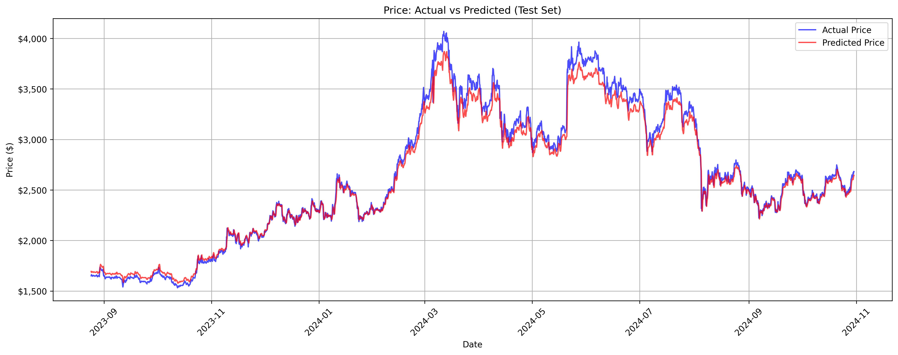

- Model closely tracks actual price movements from $1,500 to $4,000 range
- Particularly accurate in trend following during 2023-2024
- Some minor deviations at price peaks, especially around $4,000 mark

### Training performance
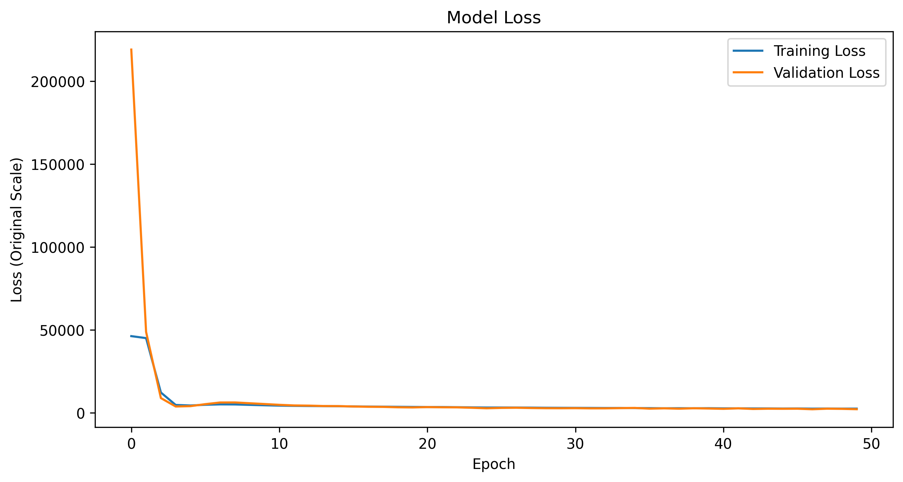

- Very sharp initial decrease in both training and validation loss
- Rapid convergence within first 5 epochs
- Stable and consistent loss after epoch 10
- Training and validation losses align well, indicating good fit

### Metrics
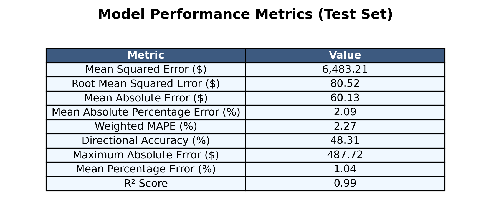

- Strong R² score of 0.99, indicating the model explains 99% of the price variance
- Low MAPE of 2.09%
- High precision with RMSE of $80.52 and mean absolute error of $60.13
- Maximum absolute error of $487.72
- Mean absolute error of $60.13

### Other results
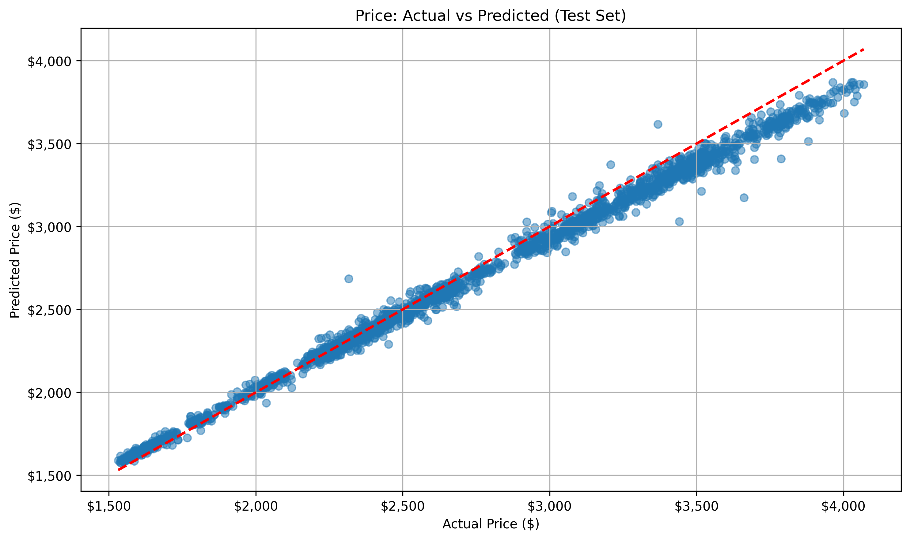
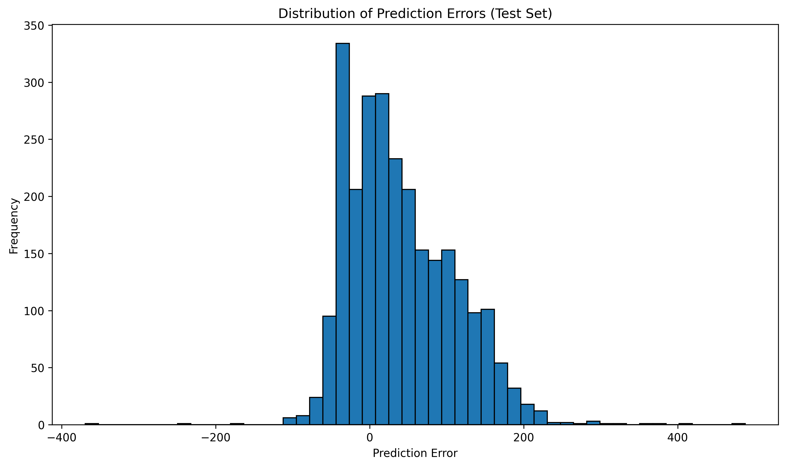
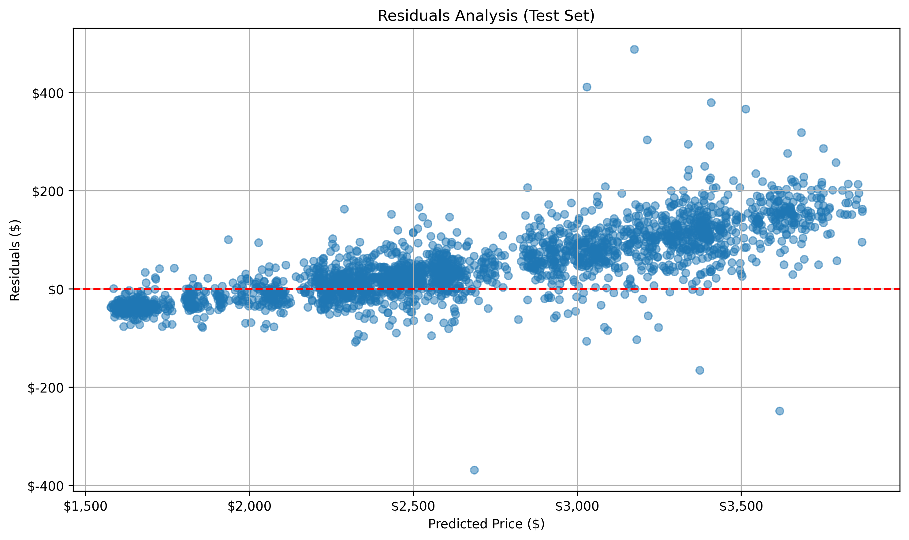
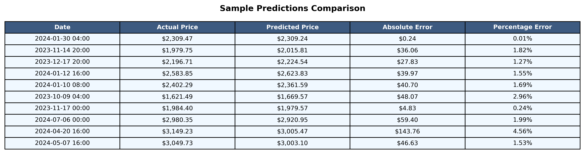
[Raw Training Log](results/eth/training.log)
[Model Specifications](results/eth/model_specifications.txt)