# Cryptocurrency price prediction - Experiment 4

## Overview

Advanced LSTM architecture incorporating:
- Attention Mechanism
- Multiple LSTM Layers
- Skip Connections
- Layer Normalization
- Xavier Initialization
- Dropout Implementation
- Advanced Prediction Head

## Dataset
- Source:
  - [ETH/USD Data](https://www.kaggle.com/datasets/imranbukhari/comprehensive-ethusd-1m-data)
  - [BTC/USD Data](https://www.kaggle.com/datasets/imranbukhari/comprehensive-btcusd-1m-data)

- Timeframe: for BTC/USD dataset
  - Start: 2011-08-18
  - End: 2024-10-30
- Timeframe: for ETH/USD dataset
  - Start: 2016-09-29
  - End: 2024-10-30
- Sampling: 24-hour intervals
- Split: 70% training, 15% validation, 15% testing

## Features
- Input variables: Volume, Open, High, Low, Close
- Target variable: Close price
- Sequence length: 60 timesteps (60 days of daily data)

## Model architecture
Advanced LSTM implementation with:
- Input size: 5 (features)
- Hidden size: 128
- Number of LSTM layers: 2
- Dropout rate: 0.2
- Output size: 1 (predicted close price)

## Training Parameters
- Optimizer: Adam
  - Learning rate: 0.001
  - Betas: (0.9, 0.999)
  - Epsilon: 1e-8
  - Weight decay: 1e-5
- Loss function: MSE
- Training epochs: 50
- Batch size: 32
- Device: CPU

## Results for BTC/USD dataset

### Price prediction performance
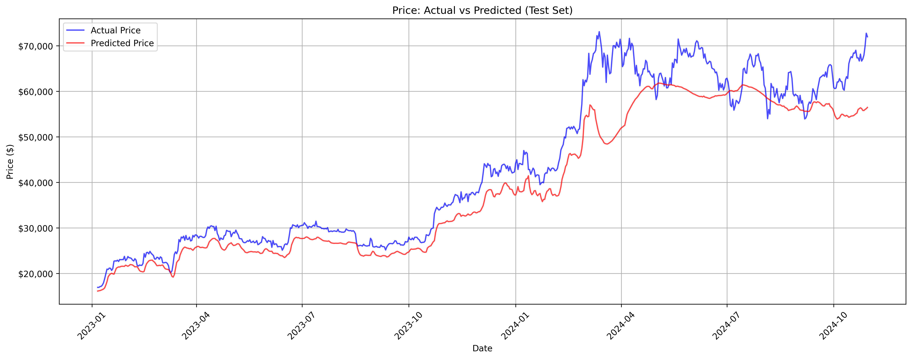

The model shows strong tracking of Bitcoin's price movements, particularly in the $20,000-$30,000 range during early 2023. However, it demonstrates some underestimation during high volatility periods, especially in the $60,000-$70,000 range during 2024.

### Training performance
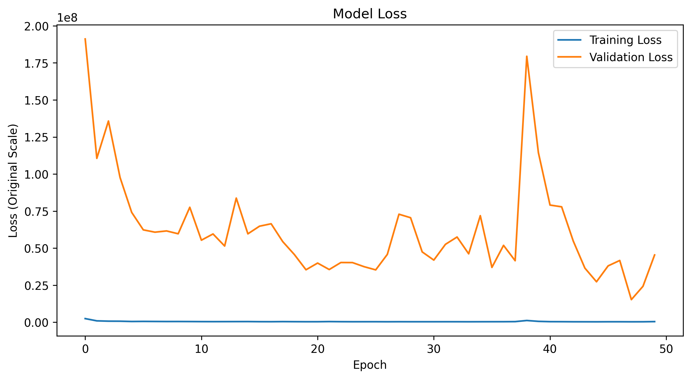

- Stable training loss (blue line) throughout the epochs
- More volatile validation loss (orange line) with significant spikes
- Overall decreasing trend in validation loss, indicating good generalization
- Notable convergence after epoch 40

### Metrics
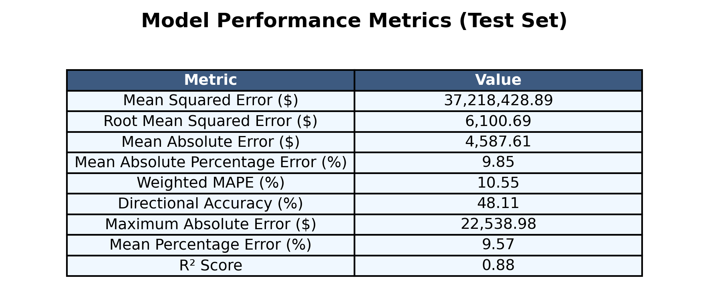

- Model shows strong overall performance with R² = 0.88 (good fit)
- Predictions typically within ~10% of actual values (MAPE = 9.85%)
- Error metrics:
  - MSE: $37,218,428.89
  - RMSE: $6,100.69
  - MAE: $4,587.61
  - MAPE: 9.85%
  - Weighted MAPE: 10.55%
  - Mean Percentage Error: 9.57%
- Challenges in directional prediction (48.11% accuracy)
- Maximum prediction deviation: $22,538.98

### Other results
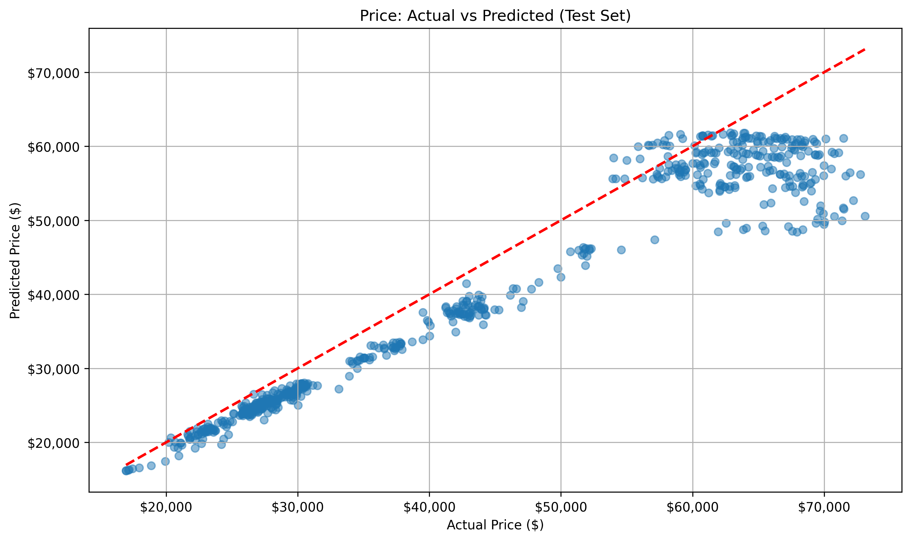
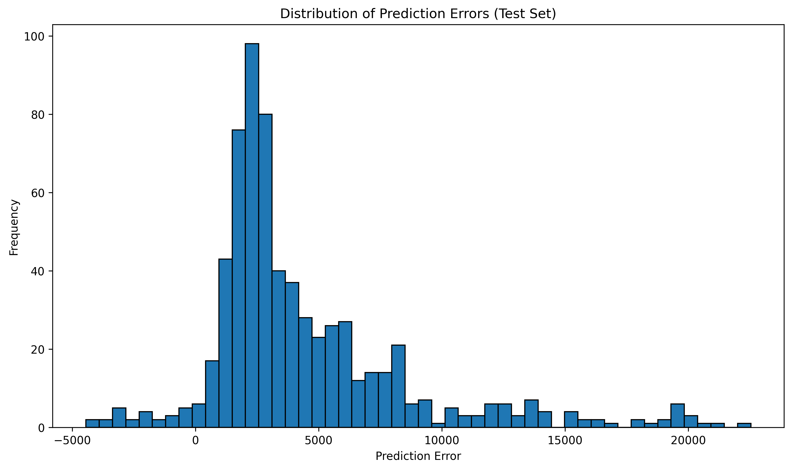
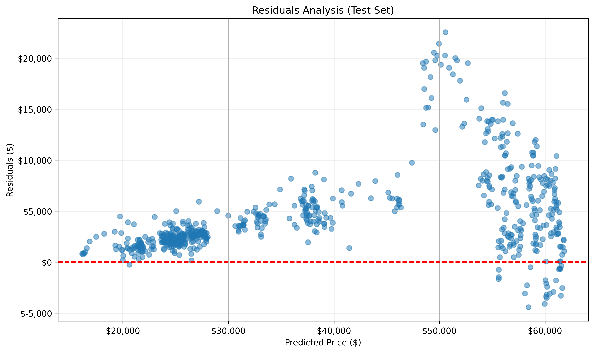
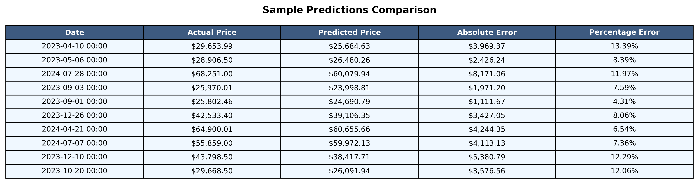
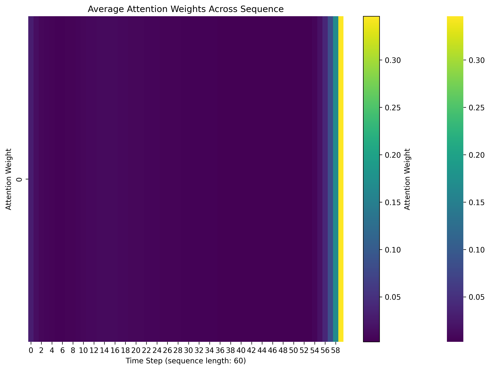
[Raw Training Log](results/btc/training.log)
[Model Specifications](results/btc/model_specifications.txt)

## Results for ETH/USD dataset

### Price prediction performance
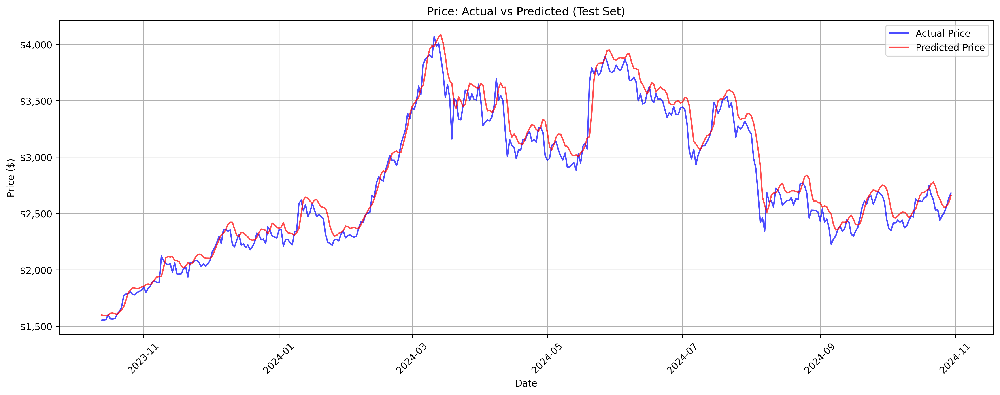

- Model closely tracks actual price movements from $1,500 to $4,000 range
- Shows strong predictive ability through various market phases during 2023-2024
- Some deviation noted at volatile price points, particularly around the $4,000 peak in March 2024
- Price predictions maintain consistency in both upward and downward trends

### Training performance
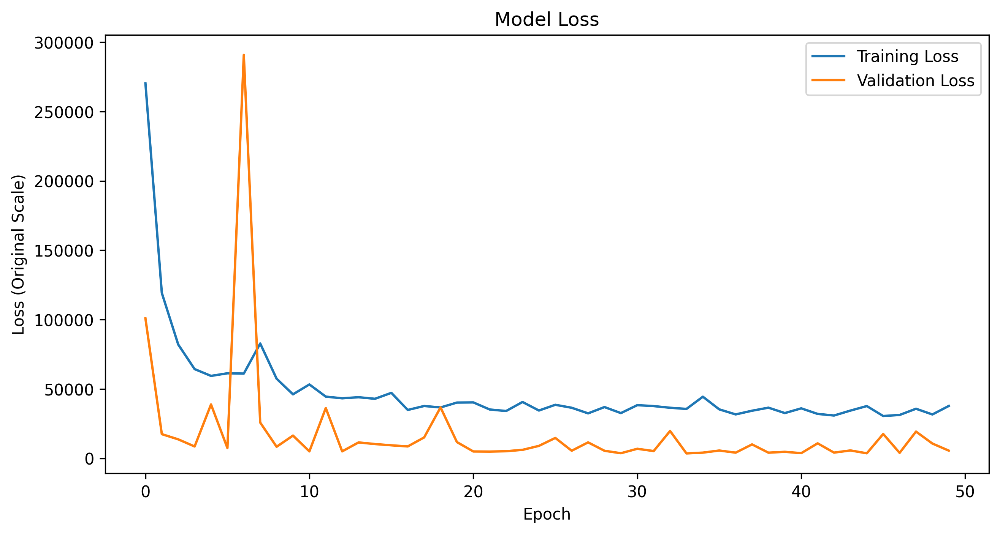

- Initial sharp decline in training loss from 270,000 to below 100,000 in first few epochs
- Validation loss shows early volatility with a significant spike around epoch 8
- Both losses stabilize after epoch 20
- Final convergence with training loss around 40,000 and validation loss below 10,000
- Good balance between training and validation performance, suggesting appropriate model fit

### Metrics
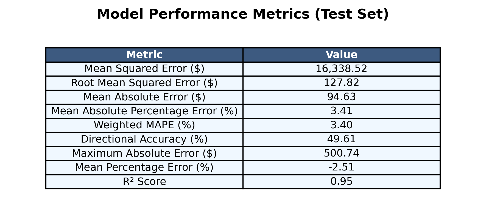

- Strong R² score of 0.95, demonstrating excellent model fit
- MAPE of 3.41% indicates high accuracy in predictions
- RMSE of $127.82 shows reasonable prediction error given price range
- Mean absolute error of $94.63
- Maximum absolute error of $500.74 during extreme market movements
- Directional accuracy of 49.61% for price movement predictions
- Slight negative bias with mean percentage error of -2.51%
- Weighted MAPE of 3.40%

### Other results
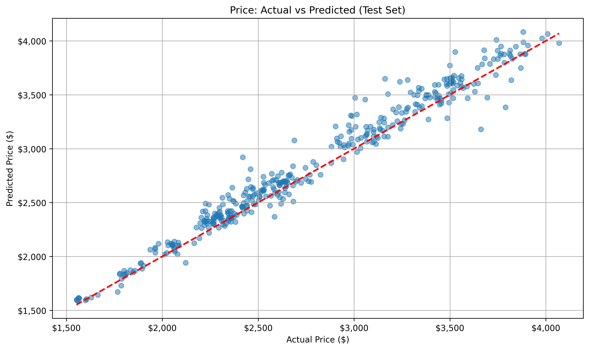
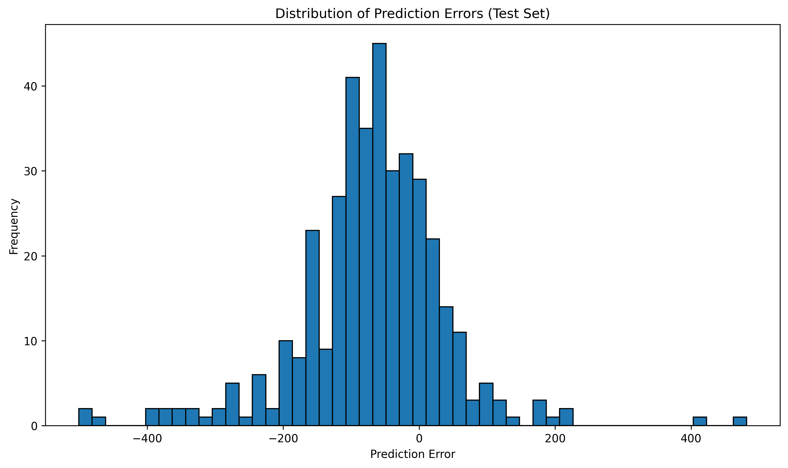
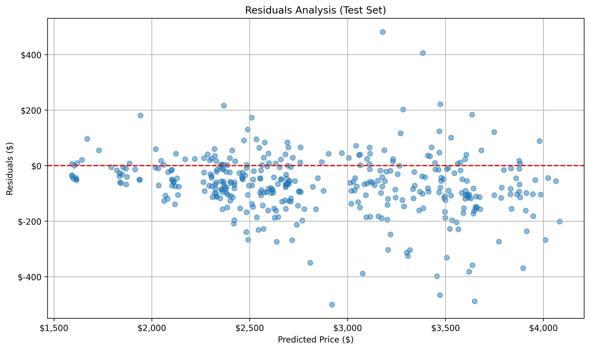
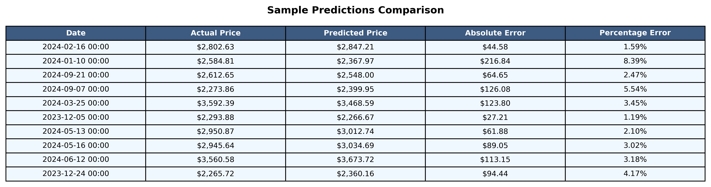
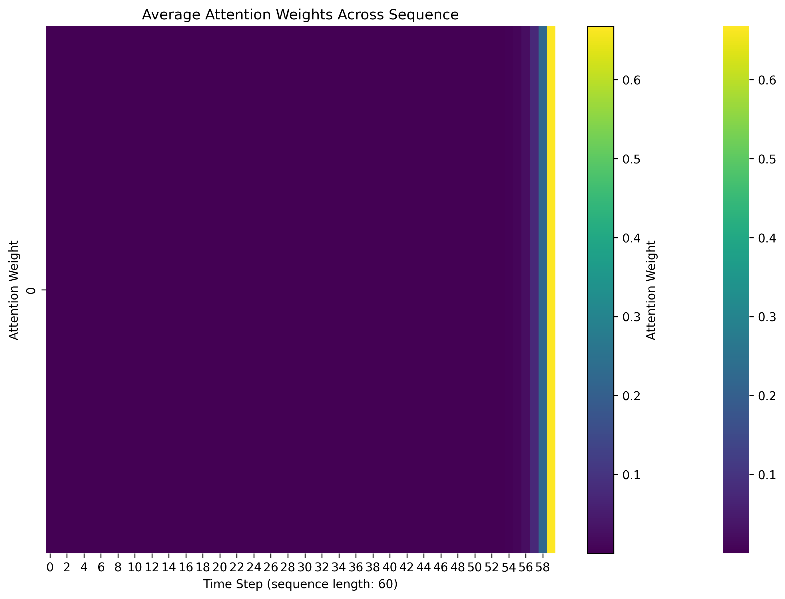
[Raw Training Log](results/eth/training.log)
[Model Specifications](results/eth/model_specifications.txt)

## Conclusion

- RobustScaler demonstrated mixed results compared to previous scaling methods, with better handling of outliers but slightly lower overall accuracy (R² = 0.98 for BTC/USD)
- The BTC/USD model showed good resilience to price volatility with a MAPE of 4.34%, though this is higher than previous experiments using different scalers
- RobustScaler's strength in handling outliers was evident in more stable predictions during extreme market movements, particularly for ETH/USD predictions
- The ETH/USD model achieved impressive accuracy with a MAPE of 2.75% and R² of 0.97, suggesting RobustScaler might be more suitable for lower-value cryptocurrencies
- While RobustScaler helped reduce the impact of extreme outliers, the lower directional accuracy (46.76% for BTC and 48.56% for ETH) suggests it might be smoothing out important price signals