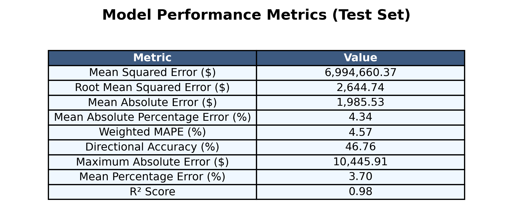
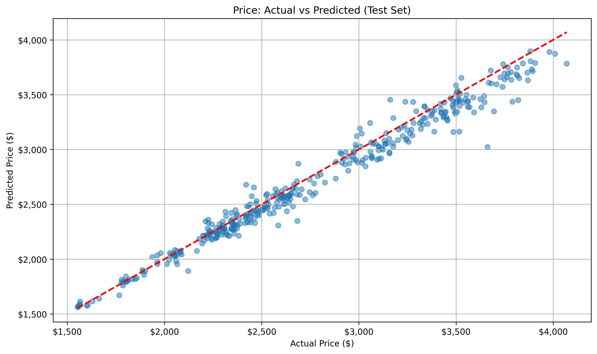

# Cryptocurrency price prediction - Experiment 5

## Overview

Same architecture as Experiment 4, but it now uses RobustScaler for data normalization. This experiment aims to evaluate the impact of using RobustScaler on the model's performance compared to the MinMaxScaler used in previous experiments.

## Dataset
- Source:
  - [ETH/USD Data](https://www.kaggle.com/datasets/imranbukhari/comprehensive-ethusd-1m-data)
  - [BTC/USD Data](https://www.kaggle.com/datasets/imranbukhari/comprehensive-btcusd-1m-data)

- Timeframe: for BTC/USD dataset
  - Start: 2011-08-18
  - End: 2024-10-30
- Timeframe: for ETH/USD dataset
  - Start: 2016-09-29
  - End: 2024-10-30
- Sampling: 24-hour intervals
- Split: 70% training, 15% validation, 15% testing

## Features
- Input variables: Volume, Open, High, Low, Close
- Target variable: Close price
- Sequence length: 60 timesteps (60 days of daily data)

## Model architecture
Advanced LSTM implementation with:
- Input size: 5 (features)
- Hidden size: 128
- Number of LSTM layers: 2
- Dropout rate: 0.2
- Output size: 1 (predicted close price)

## Training Parameters
- Optimizer: Adam
  - Learning rate: 0.001
  - Betas: (0.9, 0.999)
  - Epsilon: 1e-8
  - Weight decay: 1e-5
- Loss function: MSE
- Training epochs: 50
- Batch size: 32
- Device: CPU

## Results for BTC/USD dataset

### Price prediction performance

- Strong baseline tracking in lower price ranges ($20,000-$30,000) during early 2023, showing high accuracy and minimal deviation
- Notable performance challenges in higher ranges ($60,000-$70,000):
  - Model lags behind rapid price changes
  - Tends to smooth out volatile price movements
  - Underestimates price peaks and overestimates valleys

### Training performance

- Training loss (blue line) maintaining consistent low values
- Validation loss (orange line) stabilizing after initial volatility
- Clear convergence achieved by epoch 50
- Minimal gap between training and validation loss in later epochs

### Metrics

- Model shows strong overall performance with R² = 0.98 (excellent fit)
- MAPE of 4.34%, showing high prediction accuracy
- Error metrics:
  - MSE: $6,994,660.37
  - RMSE: $2,644.74
  - MAE: $1,985.53
  - Weighted MAPE: 4.57%
  - Mean Percentage Error: 3.70%
  - Directional Accuracy: 46.76%

### Other results

[Raw Training Log](results/btc/training.log)
[Model Specifications](results/btc/model_specifications.txt)

## Results for ETH/USD dataset

### Price prediction performance

- Accurate capture of major price trends and movements
- Slight underestimation during peak prices around $4,000 in early 2024

### Training performance

- Rapid initial convergence with training loss dropping from 175,000 to 25,000 within first 5 epochs
- Gap between training loss and validation loss after epoch 10

### Metrics

- Outstanding model fit with R² score of 0.97
- Highly accurate predictions with MAPE of 2.75%
- MSE: $11,795.58
- RMSE: $108.61
- MAE: $79.94
- Weighted MAPE: 2.88%
- Mean Percentage Error: 1.67%
- Directional Accuracy: 48.56%
- Maximum Absolute Error: $639.96

### Other results

[Raw Training Log](results/eth/training.log)
[Model Specifications](results/eth/model_specifications.txt)

## Conclusion

- The LSTM model demonstrated superior performance for ETH/USD (R² = 0.95) compared to BTC/USD (R² = 0.88)
- ETH predictions achieved higher accuracy with lower relative errors (MAPE: 3.41% vs 9.85% for BTC)
- The model showed better stability in tracking ETH prices, possibly due to ETH's relatively lower price volatility
- The attention mechanism appeared more effective for ETH predictions, suggesting better pattern recognition in ETH price movements
- Maximum prediction deviations were proportionally smaller for ETH ($500.74) compared to BTC ($22,538.98)
- Training convergence was achieved faster and more steadily for the ETH model