# Cryptocurrency price prediction - Experiment 6

## Overview

Same architecture as Experiment 5, but it now uses StandardScaler with Log Transformation for data normalization. This experiment aims to evaluate the impact of these normalization techniques compared to the RobustScaler used in the previous experiment.

## Conclusion

- The StandardScaler with Log Transformation demonstrates superior performance compared to RobustScaler, achieving an exceptional R² = 0.99 for BTC/USD (up from 0.98) and maintaining a strong R² = 0.94 for ETH/USD
- BTC/USD predictions show remarkable improvement with a MAPE of 2.79%, compared to the previous 4.34% using RobustScaler, indicating significantly enhanced accuracy
- The Maximum Absolute Error for ETH/USD increased slightly to $734.41 (from $639.96), suggesting some trade-offs in extreme value handling
- While RobustScaler showed better stability in training/validation loss convergence, the StandardScaler with Log Transformation achieved better overall accuracy metrics

## Dataset
- Source:
  - [ETH/USD Data](https://www.kaggle.com/datasets/imranbukhari/comprehensive-ethusd-1m-data)
  - [BTC/USD Data](https://www.kaggle.com/datasets/imranbukhari/comprehensive-btcusd-1m-data)

- Timeframe: for BTC/USD dataset
  - Start: 2011-08-18
  - End: 2024-10-30
- Timeframe: for ETH/USD dataset
  - Start: 2016-09-29
  - End: 2024-10-30
- Sampling: 24-hour intervals
- Split: 70% training, 15% validation, 15% testing

## Features
- Input variables: Volume, Open, High, Low, Close
- Target variable: Close price
- Sequence length: 60 timesteps (60 days of daily data)

## Model architecture
Advanced LSTM implementation with:
- Input size: 5 (features)
- Hidden size: 128
- Number of LSTM layers: 2
- Dropout rate: 0.2
- Output size: 1 (predicted close price)

## Training Parameters
- Optimizer: Adam
  - Learning rate: 0.001
  - Betas: (0.9, 0.999)
  - Epsilon: 1e-8
  - Weight decay: 1e-5
- Loss function: MSE
- Training epochs: 50
- Batch size: 32
- Device: CPU

## Results for BTC/USD dataset

### Price prediction performance
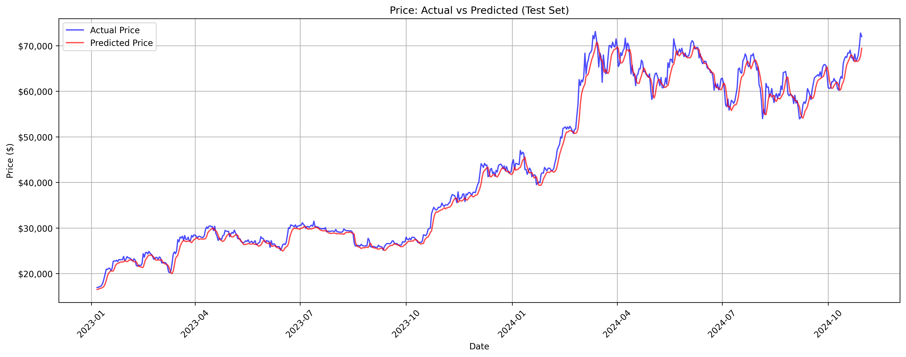

- Strong baseline tracking in lower price ranges ($20,000-$30,000) during early 2023, showing high accuracy and minimal deviation
- Notable performance challenges in higher ranges ($60,000-$70,000):
  - Model lags behind rapid price changes
  - Tends to smooth out volatile price movements
  - Underestimates price peaks and overestimates valleys

### Training performance
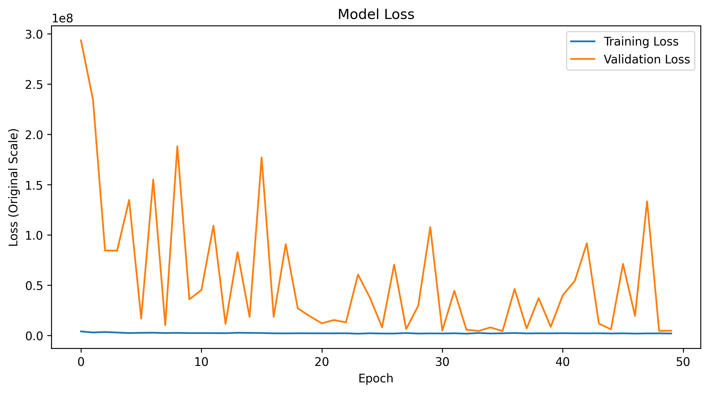

- Training loss (blue line) shows consistent stability throughout training
- Validation loss fluctuations, don't stabilize

### Metrics
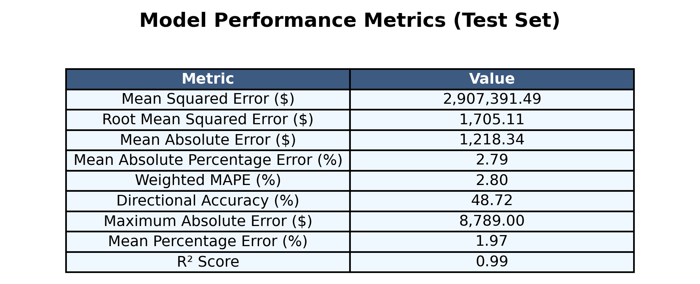

- Model demonstrates exceptional performance with R² = 0.99 (near-perfect fit)
- MAPE of 2.79%, indicating very high prediction accuracy
- Error metrics:
  - MSE: $2,907,391.49
  - RMSE: $1,705.11
  - MAE: $1,218.34
  - Weighted MAPE: 2.80%
  - Mean Percentage Error: 1.97%
  - Directional Accuracy: 48.72%
  - Maximum Absolute Error: $8,789.00

### Other results
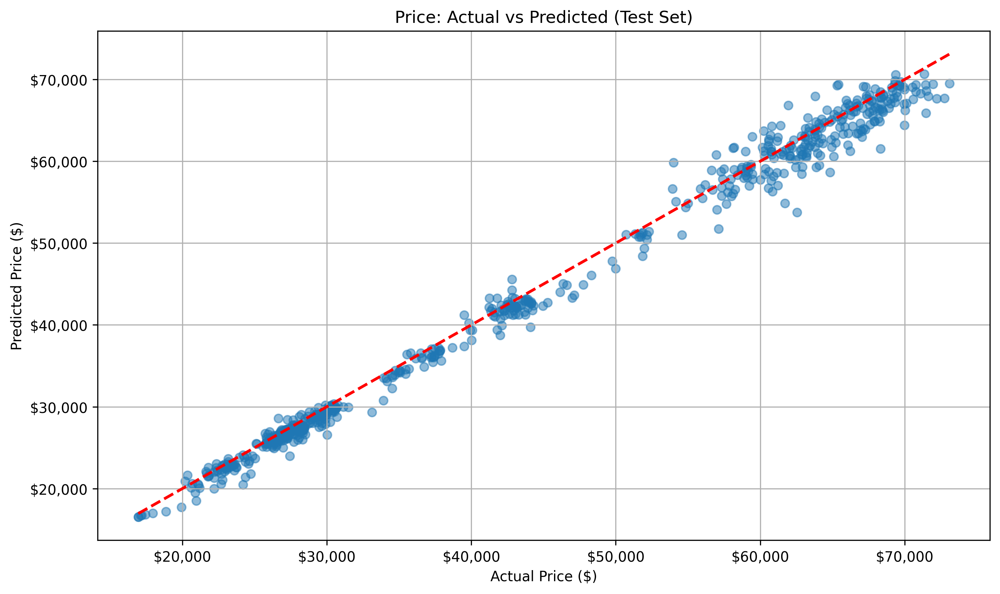
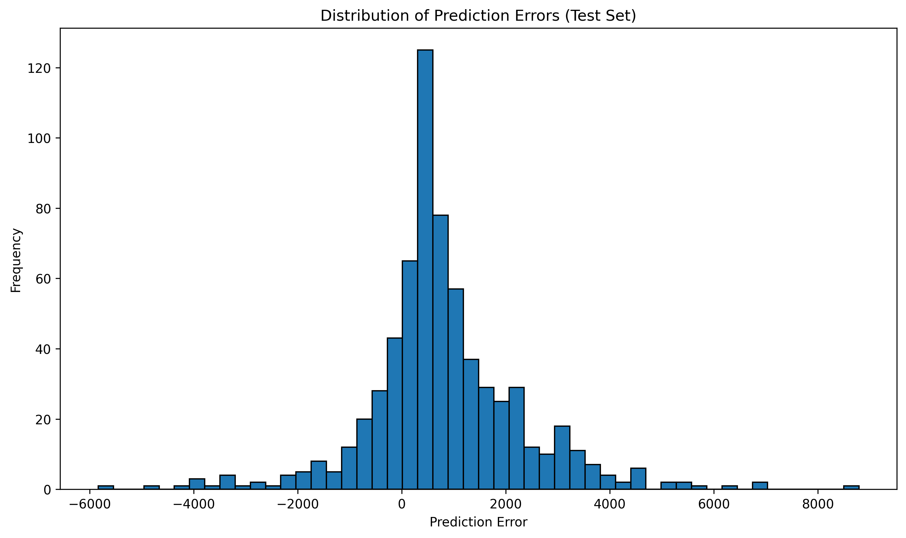
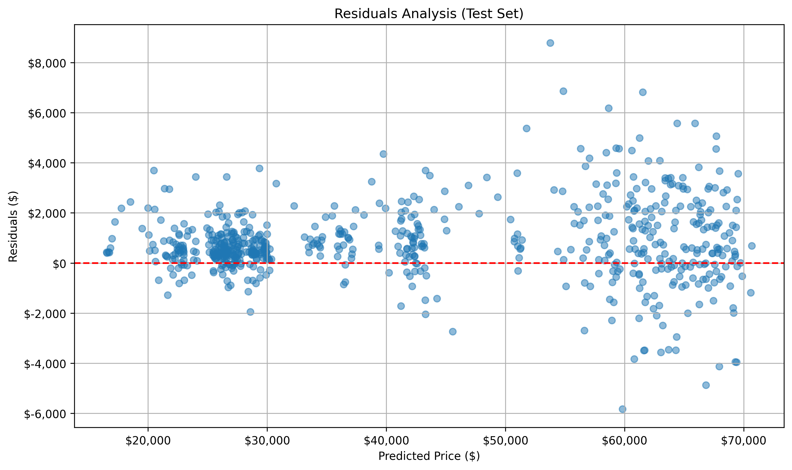
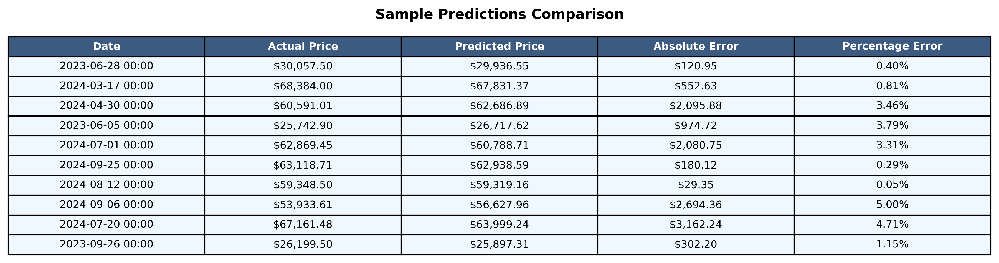
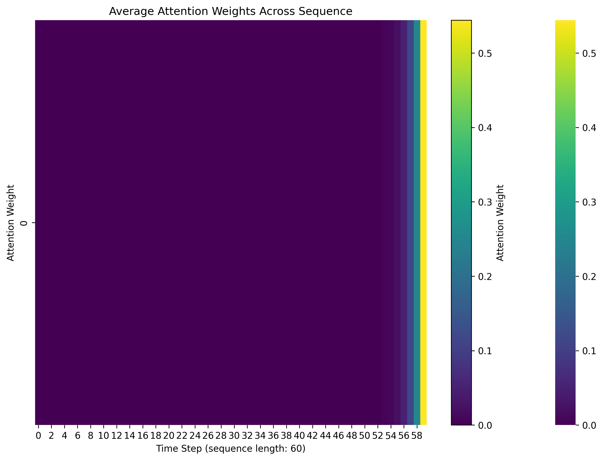
[Raw Training Log](results/btc/training.log)
[Model Specifications](results/btc/model_specifications.txt)

## Results for ETH/USD dataset

### Price prediction performance
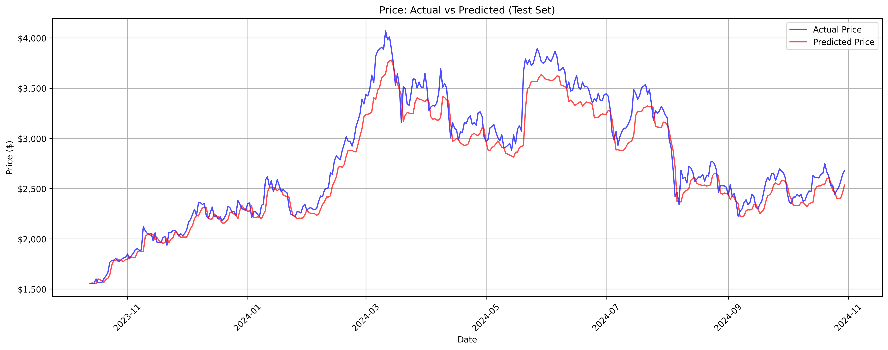

- Peak prices reached around $4,000 in March 2024, with model showing underestimation

### Training performance
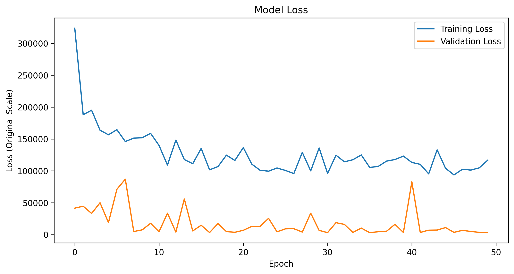

- Validation loss, Training loss fluctuations, don't stabilize until last epochs

### Metrics
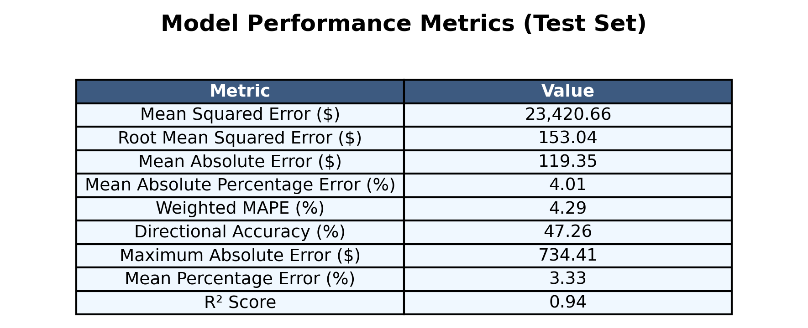

- Strong model fit with R² score of 0.94
- Reliable predictions with MAPE of 4.01%
- MSE: $23,420.66
- RMSE: $153.04
- MAE: $119.35
- Weighted MAPE: 4.29%
- Mean Percentage Error: 3.33%
- Directional Accuracy: 47.26%
- Maximum Absolute Error: $734.41

### Other results
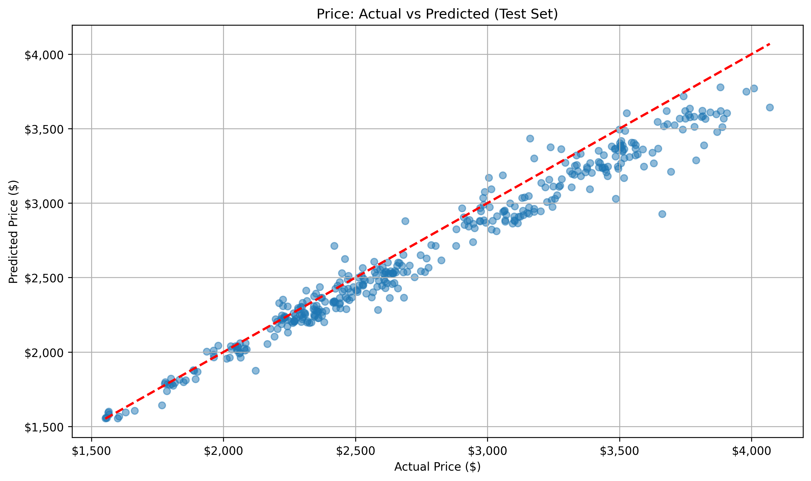
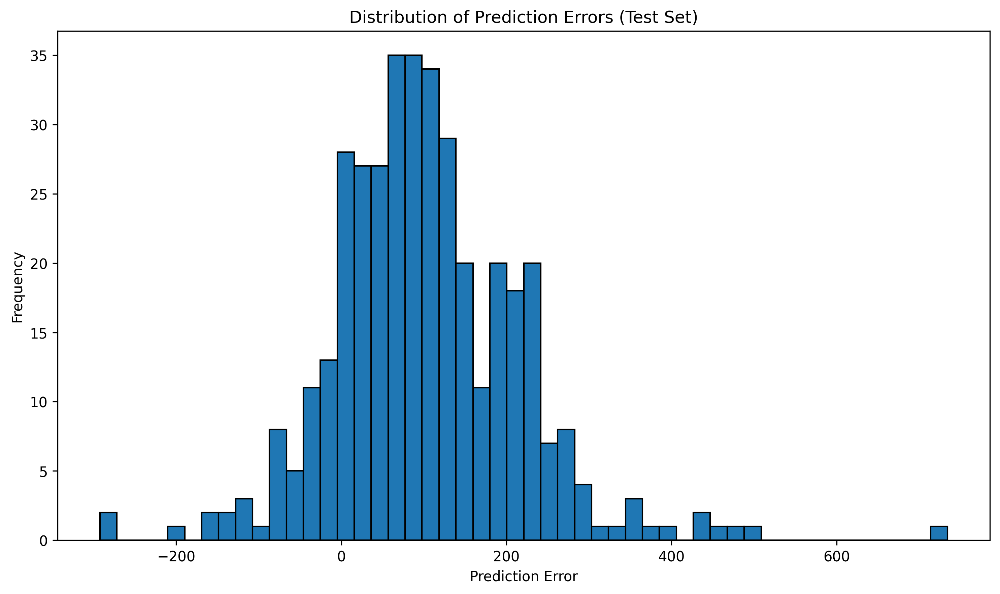
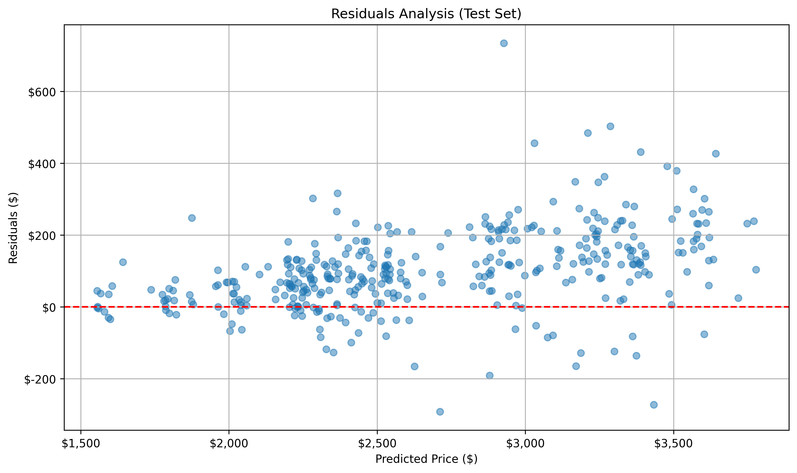
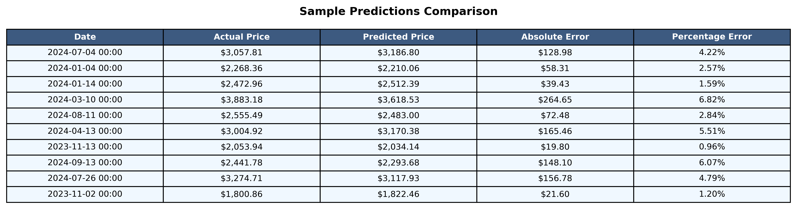
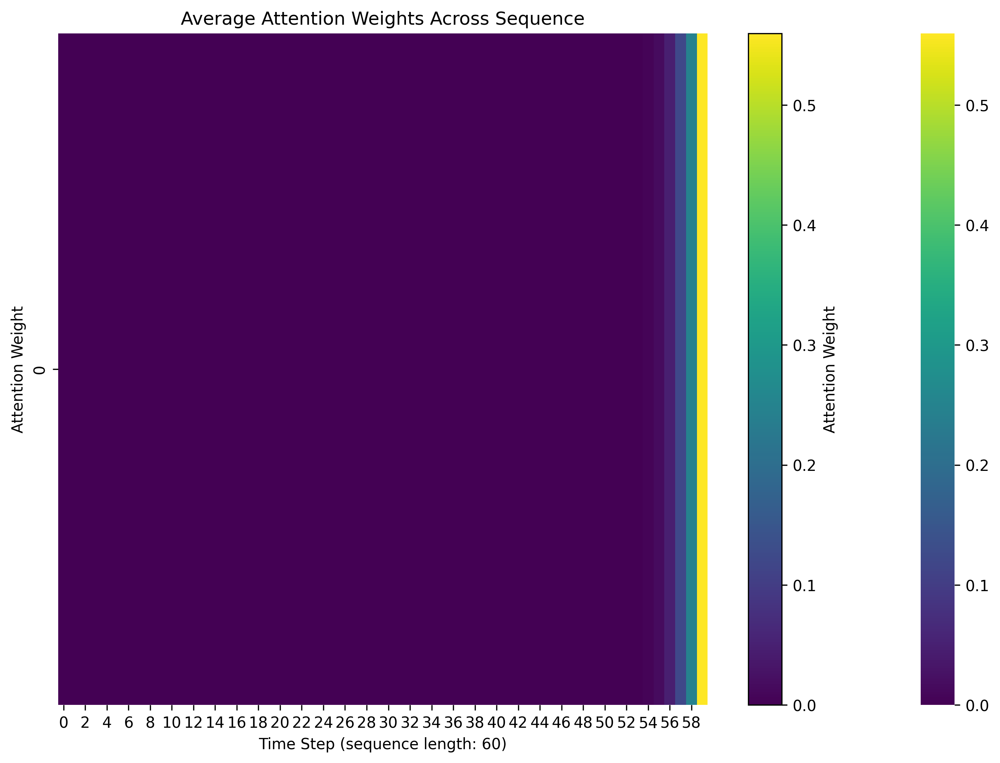
[Raw Training Log](results/eth/training.log)
[Model Specifications](results/eth/model_specifications.txt)