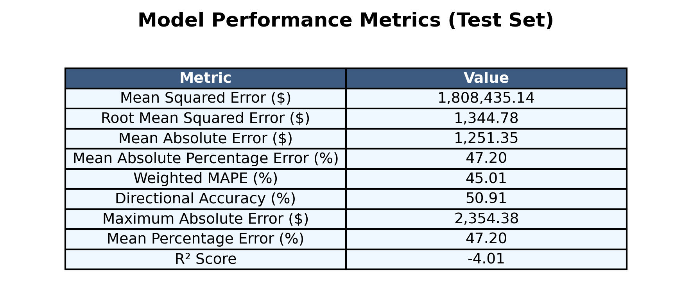

# Cryptocurrency price prediction - Experiment 7

## Overview

This experiment uses a custom SSA (Sparrow Search Algorithm) optimizer to improve the performance of the LSTM model. The SSA optimizer implements a nature-inspired optimization algorithm that mimics the foraging behavior of sparrows, with detector and follower agents working together to find optimal solutions. Initial idea from MS-SSA-LSTM methodology presented in ["A Stock Price Prediction Model Based on Investor Sentiment and Optimized Deep Learning"](https://ieeexplore.ieee.org/document/10130578) (IEEE 2023)

## Dataset
- Source:
  - [ETH/USD Data](https://www.kaggle.com/datasets/imranbukhari/comprehensive-ethusd-1m-data)
  - [BTC/USD Data](https://www.kaggle.com/datasets/imranbukhari/comprehensive-btcusd-1m-data)

- Timeframe: for BTC/USD dataset
  - Start: 2011-08-18
  - End: 2024-10-30
- Timeframe: for ETH/USD dataset
  - Start: 2016-09-29
  - End: 2024-10-30
- Sampling: 24-hour intervals
- Split: 70% training, 15% validation, 15% testing

## Features
- Input variables: Volume, Open, High, Low, Close
- Target variable: Close price
- Sequence length: 60 timesteps (60 days of daily data)

## Model architecture
Advanced LSTM implementation with:
- Input size: 5 (features)
- Hidden size: 128
- Number of LSTM layers: 2
- Dropout rate: 0.2
- Output size: 1 (predicted close price)

## Training Parameters
- Optimizer: SSA (Sparrow Search Algorithm)
  - Population size: 50
  - Alarm value (a): 0.8
  - Sparrow threshold (ST): 0.6
  - Diversity weight: 0.1
- Loss function: MSE
- Training epochs: 5
- Batch size: 32
- Device: CPU

## Results for BTC/USD dataset

### Price prediction performance

- Model significantly underperforms across all price ranges
- Large systematic gap between actual and predicted values:
  - Actual prices range from $20,000 to $70,000
  - Predicted values consistently lower, reaching only $30,000 at peak
- Poor adaptation to price trends and market dynamics
- Notable failure to capture the substantial price increase from Q4 2023 onwards

### Training performance

- Training loss (blue line) remains flat and low
- Validation loss (orange line) shows consistently high values
- Clear indication of model underfitting

### Metrics

- Model demonstrates poor performance with negative R² = -1.81 (indicating worse than baseline)
- High error rates across all metrics:
  - MSE: $839,030,291.82
  - RMSE: $28,966.02
  - MAE: $27,399.29
  - MAPE: 65.04%
  - Weighted MAPE: 63.01%
  - Directional Accuracy: 51.89% (barely better than random)
  - Maximum Absolute Error: $52,855.39
  - Mean Percentage Error: 65.04%

### Other results

[Raw Training Log](results/btc/training.log)
[Model Specifications](results/btc/model_specifications.txt)

## Results for ETH/USD dataset

### Price prediction performance

- Model significantly underperforms across all price ranges
- Large systematic gap between actual and predicted values:
  - Actual prices range from $1,500 to $4,000
  - Predicted values consistently lower, ranging from $0 to $2,000
- Poor adaptation to price trends and market dynamics
- Notable failure to capture price fluctuations throughout 2024

### Training performance

- Training loss (blue line) shows slight decline but remains relatively stable around 2.2M
- Validation loss (orange line) remains consistently high at around 2.9M
- Clear indication of model underfitting

### Metrics

- Model demonstrates poor performance with negative R² = -4.01 (indicating worse than baseline)
- High error rates across all metrics:
  - MSE: $1,808,435.14
  - RMSE: $1,344.78
  - MAE: $1,251.35
  - MAPE: 47.20%
  - Weighted MAPE: 45.01%
  - Directional Accuracy: 50.91% (barely better than random)
  - Maximum Absolute Error: $2,354.38
  - Mean Percentage Error: 47.20%

### Other results

[Raw Training Log](results/eth/training.log)
[Model Specifications](results/eth/model_specifications.txt)

## Conclusion

- Both LSTM models demonstrated significantly poor performance with negative R² values (BTC: -1.81, ETH: -4.01), indicating worse than baseline predictions
- The models severely underperformed for both cryptocurrencies, with high error rates (MAPE: 65.04% for BTC, 47.20% for ETH)
- Both models showed signs of underfitting, with validation losses remaining consistently high
- Directional accuracy was near random for both assets (BTC: 51.89%, ETH: 50.91%)
- The SSA (Sparrow Search Algorithm) optimizer implementation:
  - Failed to provide meaningful improvements over traditional optimizers
  - Showed signs of underfitting for both cryptocurrencies
  - May require significant hyperparameter tuning or architectural modifications
- *Note: Because of the high computational cost when using the SSA optimizer, only 5 epochs were trained for each model. This may have limited the optimizer's ability to converge to optimal solutions.*