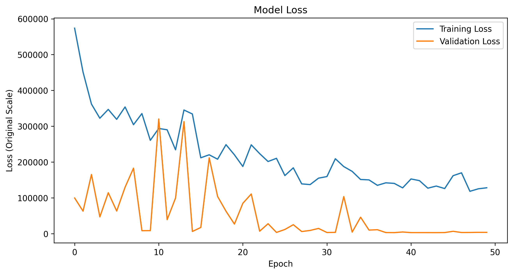

# Cryptocurrency price prediction - Experiment 8

## Overview

New architecture combining:
- LSTM with Positional Encoding
- Multi-Head Self Attention
- Gated Linear Unit (GLU)
- Temporal Convolution Network
- Enhanced processing pipeline

Added learning rate scheduling with `OneCycleLR` to improve convergence and performance.

## Conclusion

- The new combined architecture (LSTM + Positional Encoding + Multi-Head Self Attention + GLU + TCN) showed mixed results compared to the previous implementation:
  - For BTC/USD, performance significantly declined with R² dropping from 0.99 to 0.17 and MAPE increasing from 2.79% to 23.07%
  - For ETH/USD, performance improved with R² increasing from 0.94 to 0.97 and MAPE decreasing from 4.01% to 2.94%

- The architectural changes appear to have:
  - Enhanced ETH/USD prediction stability and accuracy
  - Significantly degraded BTC/USD prediction capabilities, particularly in higher price ranges
  - Introduced more pronounced lag in capturing rapid price movements for BTC
  - Improved the model's ability to handle ETH's relatively lower price volatility
  - The combination of advanced components seems better suited for mid-range price predictions (ETH) rather than high-value assets (BTC)
  - The increased complexity might be causing overfitting in the BTC model despite the higher dropout rate
  - The OneCycleLR scheduling shows promise but may need further tuning
  - The increased model capacity (hidden size 256, 3 layers) might require additional optimization for BTC predictions

## Dataset
- Source:
  - [ETH/USD Data](https://www.kaggle.com/datasets/imranbukhari/comprehensive-ethusd-1m-data)
  - [BTC/USD Data](https://www.kaggle.com/datasets/imranbukhari/comprehensive-btcusd-1m-data)

- Timeframe: for BTC/USD dataset
  - Start: 2011-08-18
  - End: 2024-10-30
- Timeframe: for ETH/USD dataset
  - Start: 2016-09-29
  - End: 2024-10-30
- Sampling: 24-hour intervals
- Split: 70% training, 15% validation, 15% testing

## Features
- Input variables: Volume, Open, High, Low, Close
- Target variable: Close price
- Sequence length: 60 timesteps (60 days of daily data)

## Model architecture
Advanced LSTM implementation with:
- Input size: 5 (features)
- Hidden size: 256 (increased from 128)
- Number of layers: 3 (increased from 2)
- Dropout rate: 0.3 (increased from 0.2)
- Output size: 1 (predicted close price)

## Training Parameters
- Optimizer: Adam
  - Learning rate: 0.001
  - Betas: (0.9, 0.999)
  - Epsilon: 1e-8
  - Weight decay: 1e-5
- Loss function: MSE
- Training epochs: 50
- Batch size: 64 (increased from 32)
- Device: CPU
- NEW: Learning rate scheduling with `OneCycleLR` to adjust learning rate dynamically during training to improve convergence
```python
scheduler = torch.optim.lr_scheduler.OneCycleLR(
    optimizer,
    max_lr=params['learning_rate'] * 3,
    epochs=params['num_epochs'],
    steps_per_epoch=len(train_loader),
    pct_start=0.3,
    div_factor=25,
    final_div_factor=10000
)
```

## Results for BTC/USD dataset

### Price prediction performance


- Model shows moderate tracking capability in lower price ranges ($20,000-$30,000) during early 2023
- Significant performance challenges in higher ranges ($60,000-$70,000):
  - Substantial underestimation of actual prices, particularly after Q1 2024
  - Limited ability to capture price volatility
  - Consistent lag in predicting major price movements
  - Model predictions remain relatively flat around $40,000 while actual prices show high variability

### Training performance


- Training loss (blue line) maintains consistently low values throughout training
- Validation loss (orange line) shows significant improvement over epochs:
  - Starting with high volatility around 0.9e9
  - Gradually decreasing and stabilizing around 0.2e9 after epoch 40
  - Some fluctuations persist but overall downward trend

### Metrics


- Model shows bad performance with R² = 0.17 (indicating poor fit)
- MAPE of 23.07%, suggesting significant prediction errors
- Error metrics:
  - MSE: $247,859,980.95
  - RMSE: $15,743.57
  - MAE: $12,183.70
  - Weighted MAPE: 28.02%
  - Directional Accuracy: 46.15%
  - Maximum Absolute Error: $32,728.03
  - Mean Percentage Error: 23.06%

### Other results


[Raw Training Log](results/btc/training.log)

[Model Specifications](results/btc/model_specifications.txt)

## Results for ETH/USD dataset

### Price prediction performance


- Peak prices reached around $4,000 in March 2024, with model showing good tracking
- Model demonstrates strong prediction capabilities across the entire test period
- Notable price movements captured well, especially during volatile periods

### Training performance


- Validation loss, Training loss fluctuations, don't stabilize until last epochs
- Gap between training and validation loss, training loss higher than validation loss

### Metrics


- Exceptional model fit with R² score of 0.97
- Very reliable predictions with MAPE of 2.94%
- MSE: $12,527.14
- RMSE: $111.92
- MAE: $82.70
- Weighted MAPE: 2.97%
- Mean Percentage Error: 1.70%
- Directional Accuracy: 48.83%
- Maximum Absolute Error: $578.59

### Other results


[Raw Training Log](results/eth/training.log)

[Model Specifications](results/eth/model_specifications.txt)