# Cryptocurrency price prediction - Experiment 9

## Overview

Same architecture as Experiment 8, but it now uses RobustScaler for data normalization. This experiment aims to improve the model's performance by addressing potential issues with data scaling and normalization.

## Dataset
- Source:
  - [ETH/USD Data](https://www.kaggle.com/datasets/imranbukhari/comprehensive-ethusd-1m-data)
  - [BTC/USD Data](https://www.kaggle.com/datasets/imranbukhari/comprehensive-btcusd-1m-data)

- Timeframe: for BTC/USD dataset
  - Start: 2011-08-18
  - End: 2024-10-30
- Timeframe: for ETH/USD dataset
  - Start: 2016-09-29
  - End: 2024-10-30
- Sampling: 24-hour intervals
- Split: 70% training, 15% validation, 15% testing

## Features
- Input variables: Volume, Open, High, Low, Close
- Target variable: Close price
- Sequence length: 60 timesteps (60 days of daily data)

## Model architecture
Advanced LSTM implementation with:
- Input size: 5 (features)
- Hidden size: 256 (increased from 128)
- Number of layers: 3 (increased from 2)
- Dropout rate: 0.3 (increased from 0.2)
- Output size: 1 (predicted close price)

## Training Parameters
- Optimizer: Adam
  - Learning rate: 0.001
  - Betas: (0.9, 0.999)
  - Epsilon: 1e-8
  - Weight decay: 1e-5
- Loss function: MSE
- Training epochs: 50
- Batch size: 64 (increased from 32)
- Device: CPU
- Learning rate scheduling with `OneCycleLR` to adjust learning rate dynamically during training to improve convergence

## Results for BTC/USD dataset

### Price prediction performance
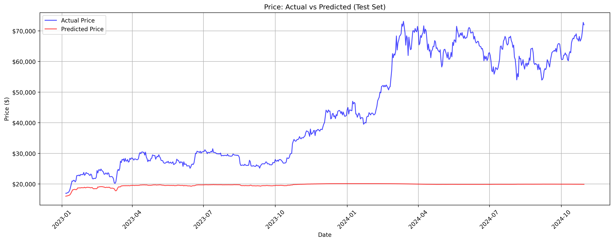

- Model shows moderate tracking capability in lower price ranges ($20,000-$30,000) during early 2023
- Significant performance challenges in higher ranges ($60,000-$70,000):
  - Substantial underestimation of actual prices, particularly after Q1 2024
  - Limited ability to capture price volatility
  - Consistent lag in predicting major price movements
  - Model predictions remain relatively flat around $40,000 while actual prices show high variability

### Training performance
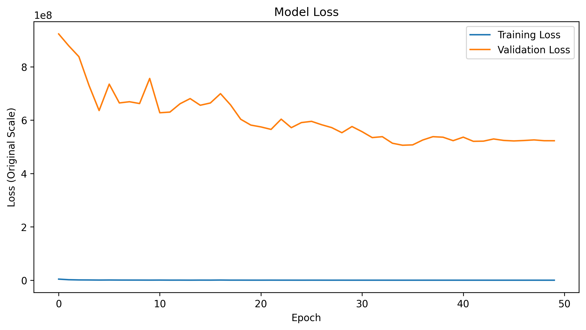

- Training loss (blue line) maintains consistently low values throughout training
- Validation loss (orange line) gradually decreases, stabiliuing around 5e8 after epoch 40
- Big gap between training and validation loss, validation loss higher than training loss

### Metrics
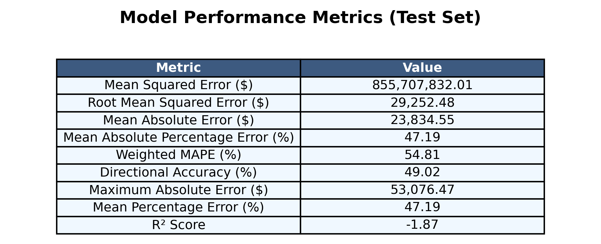

- Model shows poor performance with R² = -1.87 (indicating very poor fit)
- MAPE of 47.19%, suggesting severe prediction errors
- Error metrics:
  - MSE: $855,707,832.01
  - RMSE: $29,252.48
  - MAE: $23,834.55
  - Weighted MAPE: 54.81%
  - Directional Accuracy: 49.02%
  - Maximum Absolute Error: $53,076.47
  - Mean Percentage Error: 47.19%

### Other results
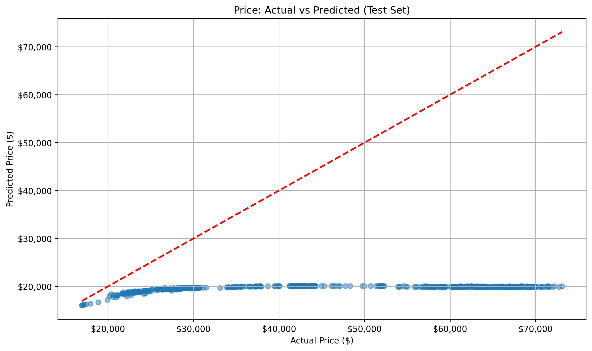
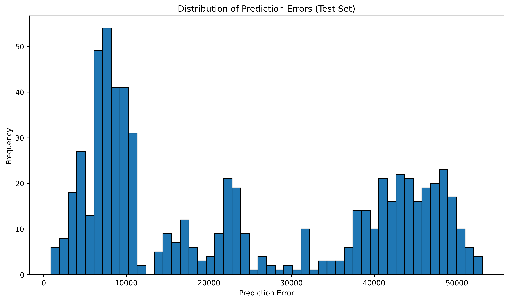
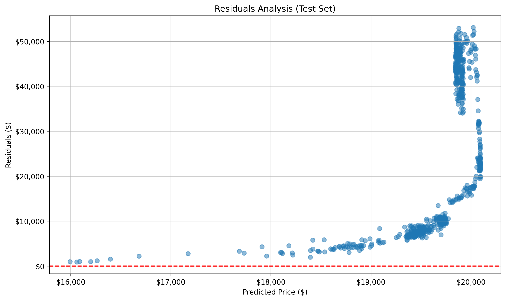
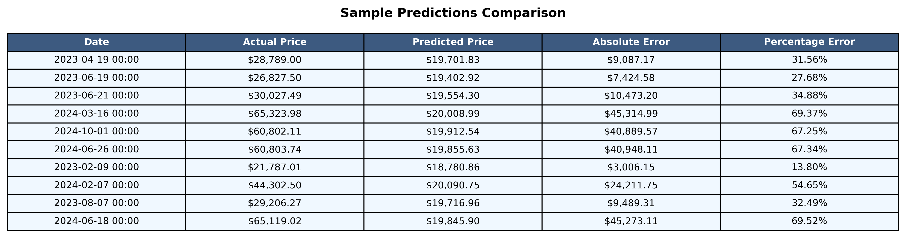
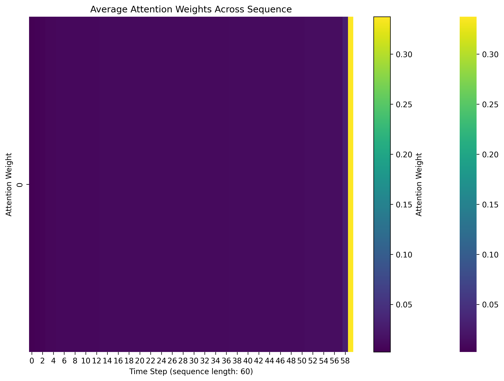
[Raw Training Log](results/btc/training.log)
[Model Specifications](results/btc/model_specifications.txt)

## Results for ETH/USD dataset

### Price prediction performance
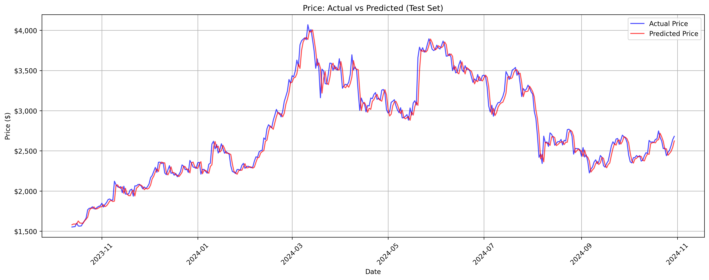

- Model demonstrates strong tracking capability across various price ranges ($1,500-$4,000) throughout 2023-2024
- Impressive performance in both low and high price ranges:
  - Close alignment between predicted and actual prices
  - Good capture of price volatility
  - Minimal lag in predicting price movements
  - Model successfully tracks both upward and downward trends
  - Particularly accurate in following major price movements from $2,000 to $4,000 range

### Training performance
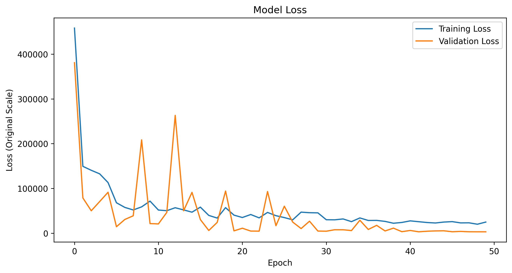

- Training loss (blue line) shows rapid initial decrease and stabilizes after epoch 30
- Validation loss (orange line) shows some volatility early on but converges well
- Both losses stabilize at lower values, indicating good model convergence
- Healthy relationship between training and validation loss, suggesting good generalization

### Metrics
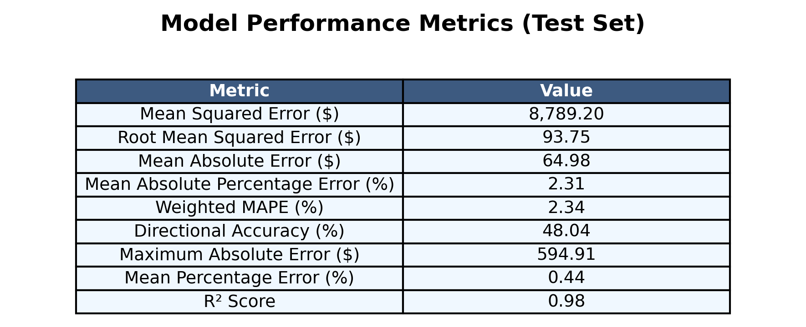

- Model shows excellent performance with R² = 0.98 (indicating very good fit)
- MAPE of 2.31%, suggesting high prediction accuracy
- Strong error metrics:
  - MSE: $8,789.20
  - RMSE: $93.75
  - MAE: $64.98
  - Weighted MAPE: 2.34%
  - Directional Accuracy: 48.04%
  - Maximum Absolute Error: $594.91
  - Mean Percentage Error: 0.44%

### Other results
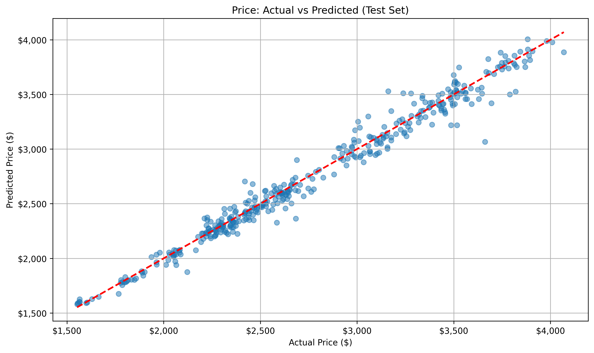
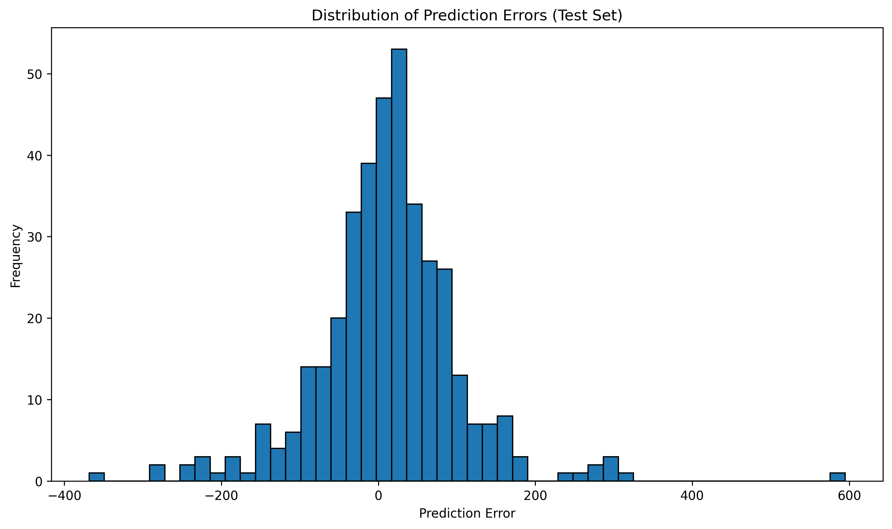
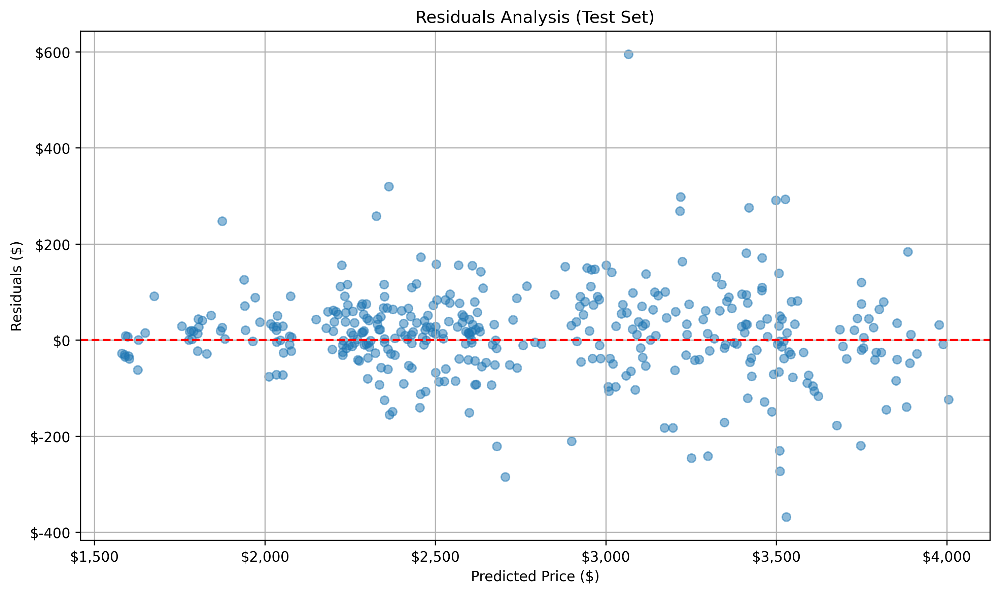
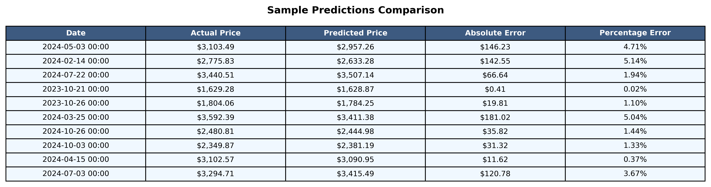
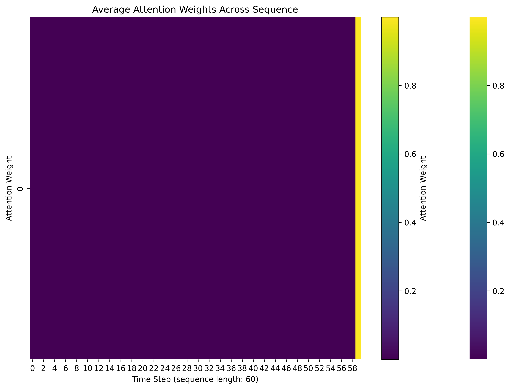
[Raw Training Log](results/eth/training.log)
[Model Specifications](results/eth/model_specifications.txt)

## Conclusion

- The RobustScaler implementation showed mixed results, with significantly better performance for ETH/USD compared to BTC/USD predictions
- ETH/USD predictions demonstrated excellent accuracy with R² = 0.98 and MAPE of 2.31%, showing consistent performance with previous scaling methods
- BTC/USD predictions deteriorated significantly with R² = -1.87 and MAPE of 47.19%, indicating RobustScaler may not be suitable for assets with extreme price ranges
- The RobustScaler appears more effective for cryptocurrencies with moderate price ranges like ETH, but struggles with BTC's wider price variations
- Training and validation loss patterns suggest better stability in the ETH model compared to BTC, though there's room for optimization
- The experiment indicates that RobustScaler may not be the optimal choice for high-value cryptocurrencies like Bitcoin, suggesting a need to explore alternative scaling methods